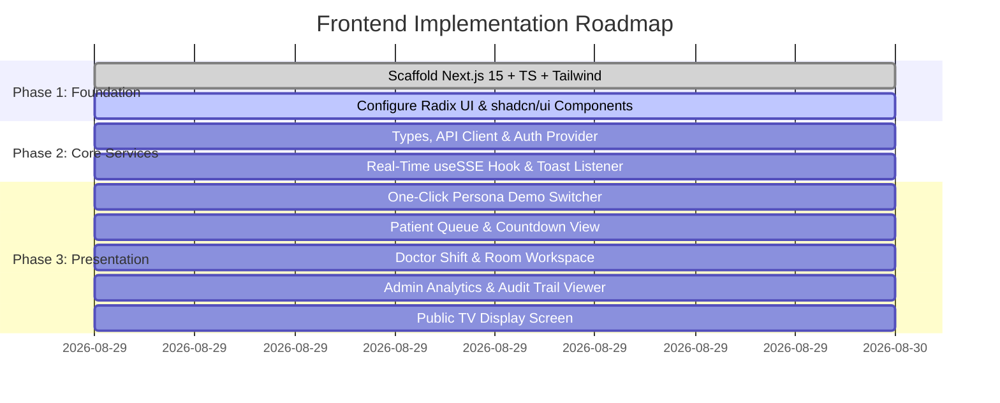

# Implementation Plan: Next.js 15 Frontend SPA & Real-Time Dashboard
**File:** `docs/plan/06-frontend-nextjs-plan.md`  
**Status:** Approved  
**Version:** `v1.0.0`  
**Target Milestone:** Feature 06 - Full-Stack Frontend Delivery  

---

## 1. Executive Summary & Objective

Implement the complete modern web user interface for the Smart Clinic Queue platform using **Next.js 15 (App Router)**, **TypeScript**, **Tailwind CSS**, **Radix UI**, and **shadcn/ui**. The frontend communicates with the Go Hexagonal backend on `:8080` via REST API and live Server-Sent Events (`/api/events`).

---

## 2. Phased Implementation Roadmap

---

## 3. Step-by-Step Task Breakdown

### Phase 1: Project Scaffolding & Component Primitives
- [ ] Initialize Next.js 15 App Router in `web/` with TypeScript, ESLint, and Tailwind CSS.
- [ ] Install dependencies:
  - `@tanstack/react-query` (TanStack Query v5)
  - `lucide-react` (Accessible SVG icons)
  - `clsx`, `tailwind-merge` (`cn()` utility)
  - `sonner` (Toast notifications)
  - `@radix-ui/react-dialog`, `@radix-ui/react-dropdown-menu`, `@radix-ui/react-switch`, `@radix-ui/react-tabs`, `@radix-ui/react-select`, `@radix-ui/react-separator`, `@radix-ui/react-progress`, `@radix-ui/react-avatar`.
- [ ] Copy and configure shadcn/ui components in `web/components/ui/` (`button`, `card`, `badge`, `switch`, `table`, `tabs`, `dialog`, `select`, `input`, `progress`, `separator`, `sonner`).
- [ ] Configure `next.config.ts` rewrites to proxy `/api/*` to `http://localhost:8080/api/*`.

---

### Phase 2: Core Services & Real-time SSE Layer
- [ ] **`web/lib/types.ts`:** Define TypeScript interfaces matching backend Go models (`User`, `Role`, `QueueTicket`, `QueueStatusResponse`, `DoctorWorkspace`, `AdminDashboardStats`, `AuditLog`, `PaginatedAuditLogs`).
- [ ] **`web/lib/api.ts`:** Create typed API client with automatic JWT token attachment and error response normalization.
- [ ] **`web/hooks/use-auth.ts`:** Implement persistent authentication state, persona profiles, login/logout, and active role guards.
- [ ] **`web/hooks/use-sse.ts`:** Build auto-reconnecting `EventSource` subscriber listening to `GET /api/events` with TanStack Query key invalidation.
- [ ] **`web/components/sse-toast-listener.tsx`:** Render unobtrusive real-time visual alerts for ticket calls and doctor status changes.

---

### Phase 3: Global Header & Persona Switcher
- [ ] **`web/components/navbar.tsx`:** Clean navigation header with active route indicators, theme toggle, and logged-in user identity.
- [ ] **`web/components/demo-switcher.tsx`:** Sticky technical evaluator bar featuring 1-click persona switching:
  - **Admin CEO**
  - **Dr. Sarah Adams** (ID 1)
  - **Dr. Brian Miller** (ID 2)
  - **Patient John Doe**
  - **Patient Lucas Smith**

---

### Phase 4: Patient Portal (`web/app/patient/page.tsx`)
- [ ] **Queue Registration Card:** Patient name input and "Join Queue" button.
- [ ] **Active Ticket Card:**
  - Ticket queue number (e.g., `A-01`).
  - Animated live wait countdown in minutes.
  - Position in queue and patients ahead count.
  - Live status indicator (`WAITING` vs `IN_CONSULTATION`).
- [ ] **Doctor Offline Banner:** Informative notice when all clinic doctors are offline.

---

### Phase 5: Doctor Workspace (`web/app/doctor/page.tsx`)
- [ ] **Doctor Shift Toggle:** Accessible Radix Switch to set `is_online` status.
- [ ] **Consultation Control Panel:**
  - "Call Next Patient" action button (with atomic backend lock).
  - Active consultation timer with live elapsed duration.
  - "Complete Consultation" button.
- [ ] **Waiting Lobby Queue Table:** Real-time preview of queued patients.

---

### Phase 6: Executive Admin Analytics & Audit Trail
- [ ] **`web/app/admin/page.tsx` (Analytics Dashboard):**
  - 4 Key KPI Scorecards (*Total Served Today, Average Wait Minutes, Online Doctors, Utilization %*).
  - Doctor Productivity & Speed Configuration Table (with inline modal to edit average consultation minutes).
- [ ] **`web/app/admin/audit/page.tsx` (Audit Trail Viewer):**
  - Activity log data table with actor, role, IP address, and timestamp.
  - Action taxonomy dropdown filter (`QUEUE_JOINED`, `TICKET_CALLED`, `CONSULTATION_FINISHED`, etc.).
  - Role dropdown filter (`patient`, `doctor`, `admin`).
  - Pagination navigation controls.

---

### Phase 7: Public TV Display Monitor (`web/app/display/page.tsx`)
- [ ] High-contrast, large-font waiting room dashboard suitable for lobby TV screens.
- [ ] Left section: Currently called ticket numbers with doctor room assignments.
- [ ] Right section: Next 5 queued tickets and clinic operational status.

---

## 4. Verification & Acceptance Criteria

1. **Compilation & Linting:** `npm run build` in `web/` completes with 0 TypeScript errors and 0 lint warnings.
2. **Real-time Synchronization:** Triggering actions from Doctor A immediately updates Patient John's screen within $< 100\text{ms}$ via SSE without page reload.
3. **Demo Switcher Ergonomics:** Reviewers can switch between all 5 personas seamlessly with a single click.
4. **Responsive & Accessible:** Fully responsive across mobile, tablet, desktop, and large 4K TV displays with clean Radix UI keyboard navigation.
