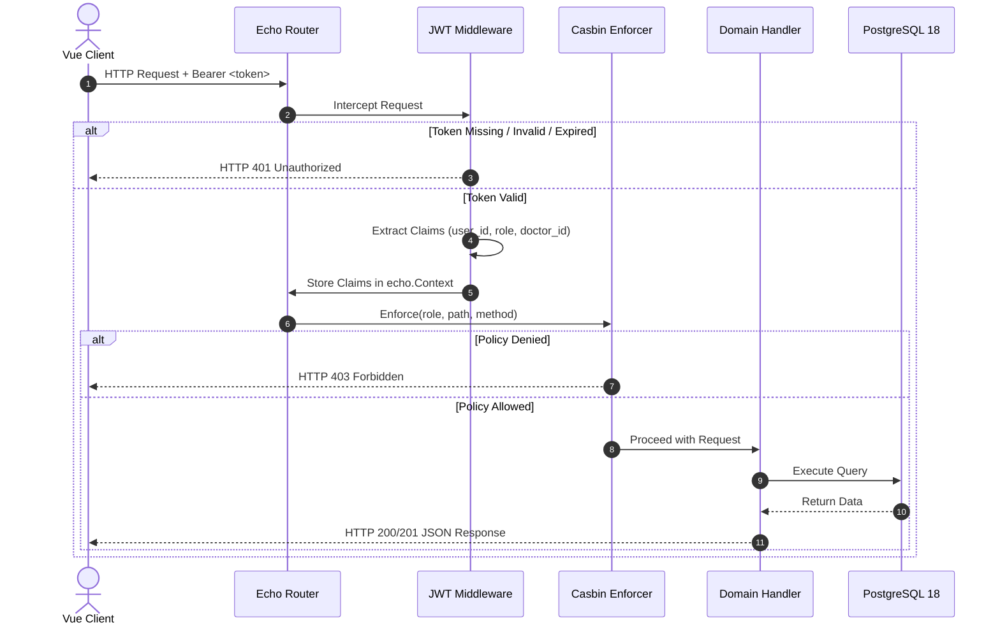

# Technical Specification: Authentication & Casbin RBAC
**File:** `docs/tech/01-auth-rbac-tech.md`  
**Status:** Approved  
**Version:** `v1.0.0`

---

## 1. Engineering Definition

The Authentication & RBAC subsystem provides stateless JWT token issuance, verification, and declarative policy enforcement via **Casbin v2** integrated into the **Echo v4 middleware pipeline**.

---

## 2. Architecture & Mechanism

### 2.1 Echo Middleware Pipeline



### 2.2 Casbin Model (`config/rbac_model.conf`)

```ini
[request_definition]
r = sub, obj, act

[policy_definition]
p = sub, obj, act

[role_definition]
g = _, _

[policy_effect]
e = some(where (p.eft == allow))

[matchers]
m = g(r.sub, p.sub) && keyMatch2(r.obj, p.obj) && regexMatch(r.act, p.act)
```

### 2.3 Casbin Policy Rules (`config/rbac_policy.csv`)

```csv
p, admin, /api/admin/*, (GET)|(POST)|(PUT)|(DELETE)
p, admin, /api/queue/*, (GET)|(POST)|(DELETE)
p, admin, /api/doctors/*, (GET)|(POST)|(PUT)

p, doctor, /api/doctors/status, POST
p, doctor, /api/doctors/call-next, POST
p, doctor, /api/doctors/finish, POST
p, doctor, /api/queue/status, GET

p, patient, /api/queue/join, POST
p, patient, /api/queue/my-ticket, GET
p, patient, /api/queue/status, GET

p, public, /api/auth/*, (GET)|(POST)
p, public, /api/events, GET
p, public, /api/queue/status, GET

g, doctor, public
g, patient, public
g, admin, public
```

---

## 3. Database Migration (Goose SQL)

```sql
-- +goose Up
CREATE TABLE IF NOT EXISTS users (
    id SERIAL PRIMARY KEY,
    username VARCHAR(50) UNIQUE NOT NULL,
    password_hash VARCHAR(255) NOT NULL,
    name VARCHAR(100) NOT NULL,
    role VARCHAR(20) NOT NULL CHECK (role IN ('patient', 'doctor', 'admin')),
    doctor_id INT,
    created_at TIMESTAMP WITH TIME ZONE DEFAULT NOW(),
    updated_at TIMESTAMP WITH TIME ZONE DEFAULT NOW()
);

CREATE INDEX IF NOT EXISTS idx_users_username ON users(username);
CREATE INDEX IF NOT EXISTS idx_users_role ON users(role);

-- +goose Down
DROP TABLE IF EXISTS users;
```

---

## 4. API Specification

### 4.1 Login Endpoint
- **URL:** `POST /api/auth/login`
- **Access:** Public
- **Request Body:**
```json
{
  "username": "doctor_a",
  "password": "password123"
}
```
- **Response (200 OK):**
```json
{
  "token": "eyJhbGciOiJIUzI1NiIsInR5cCI6IkpXVCJ9...",
  "user": {
    "id": 1,
    "username": "doctor_a",
    "name": "Dr. Sarah Adams",
    "role": "doctor",
    "doctor_id": 1
  }
}
```

### 4.2 Register Patient Endpoint
- **URL:** `POST /api/auth/register`
- **Access:** Public
- **Request Body:**
```json
{
  "username": "john_doe",
  "password": "password123",
  "name": "John Doe"
}
```
- **Response (201 Created):**
```json
{
  "token": "eyJhbGciOiJIUzI1NiIsInR5cCI6IkpXVCJ9...",
  "user": {
    "id": 5,
    "username": "john_doe",
    "name": "John Doe",
    "role": "patient"
  }
}
```

### 4.3 Current Profile Endpoint
- **URL:** `GET /api/auth/me`
- **Access:** Authenticated (Bearer Token)
- **Response (200 OK):** Current user object.

---

## 5. API Case Scenarios

| Scenario ID | Endpoint | Method | Header / Payload | Status | Response Summary |
| :--- | :--- | :---: | :--- | :---: | :--- |
| **API-AUTH-01** | `/api/auth/login` | `POST` | Valid credentials | `200 OK` | Returns JWT and user payload |
| **API-AUTH-02** | `/api/auth/login` | `POST` | Invalid password | `401 Unauthorized` | `{"error": "Invalid username or password"}` |
| **API-AUTH-03** | `/api/admin/stats` | `GET` | Patient JWT Token | `403 Forbidden` | `{"error": "Access denied: insufficient privileges"}` |
| **API-AUTH-04** | `/api/auth/register`| `POST` | Duplicate username | `409 Conflict` | `{"error": "Username is already taken"}` |
| **API-AUTH-05** | `/api/doctors/call-next`| `POST`| Missing Auth Header | `401 Unauthorized`| `{"error": "Missing or malformed JWT token"}` |

---

## 6. Unit Testing Strategy & Table Test Matrix (Hexagonal Ports & Adapters)
To achieve **100% Code Coverage**, both Hexagonal UseCases and Inbound Driving Handlers are decoupled using **Inbound & Outbound Ports** and tested with table-driven tests.

### 6.1 Hexagonal UseCase Test Matrix (`internal/core/usecase/auth_usecase_test.go`)

```go
type mockUserRepoPort struct {
    findByUsernameFunc func(ctx context.Context, username string) (*domain.User, error)
    createUserFunc     func(ctx context.Context, user *domain.User) (*domain.User, error)
    findByIDFunc       func(ctx context.Context, id int) (*domain.User, error)
}
```

| Test Case Name | Input | Mock Outbound Port Behavior | Expected Output / Error |
| :--- | :--- | :--- | :--- |
| `Doctor Login Success` | `doctor_a`, `password123` | Returns user with role `doctor` & `doctor_id: 1` | Returns JWT with doctor claims |
| `Patient Login Success`| `patient_john`, `password123` | Returns user with role `patient` | Returns JWT with patient claims |
| `Admin Login Success`  | `admin`, `password123` | Returns user with role `admin` | Returns JWT with admin claims |
| `User Not Found`       | `unknown_user`, `pass` | Returns `nil, nil` | Returns `ErrInvalidCredentials` |
| `Password Mismatch`    | `doctor_a`, `wrong_pass` | Returns user with different hash | Returns `ErrInvalidCredentials` |
| `DB Query Failure`     | `doctor_a`, `pass` | Returns `nil, sql.ErrConnDone` | Returns error propagated |
| `Register Patient OK`  | `new_user`, `pass`, `Name` | `FindByUsername` -> nil, `CreateUser` -> OK | Returns new User + JWT Token |
| `Register Duplicate`   | `doctor_a`, `pass`, `Name` | `FindByUsername` -> Returns existing user | Returns `ErrUsernameTaken` |
| `Get Profile Success`  | `userID: 1` | `FindByID` -> Returns user | Returns user without password hash |
| `Get Profile Not Found`| `userID: 999` | `FindByID` -> Returns `nil, nil` | Returns `ErrUserNotFound` |

### 6.2 Inbound Handler Test Matrix (`internal/adapters/inbound/http/auth_handler_test.go`)

| Test Case Name | HTTP Method & Path | Mock Inbound Port Response | Expected HTTP Code & Body |
| :--- | :--- | :--- | :--- |
| `Login 200 OK` | `POST /api/auth/login` | Returns Token & User | `200 OK` + Token JSON |
| `Login Bad JSON`| `POST /api/auth/login` | Invalid JSON syntax | `400 Bad Request` |
| `Login Missing Fields` | `POST /api/auth/login` | Empty username/password | `400 Bad Request` |
| `Login Invalid Creds` | `POST /api/auth/login` | `ErrInvalidCredentials` | `401 Unauthorized` |
| `Register 201 Created` | `POST /api/auth/register` | Returns Token & User | `201 Created` + User JSON |
| `Register Conflict` | `POST /api/auth/register` | `ErrUsernameTaken` | `409 Conflict` |
| `GetMe 200 OK` | `GET /api/auth/me` | Returns user from claims | `200 OK` + User Profile |
| `GetMe Unauthenticated` | `GET /api/auth/me` | Missing context claims | `401 Unauthorized` |

---

## 7. Document Revision History & Requirement Changelog

| Version | Date | Author / Role | Change Type | Change Summary / Rationale |
| :---: | :---: | :---: | :---: | :--- |
| **v1.0.0** | 2026-08-29 | Backend Lead | **Initial Baseline** | Initial technical specification for JWT authentication, Casbin model & policy configurations, Goose SQL migration, and Echo middleware interceptor sequence. |
| **v1.1.0** | 2026-08-29 | Backend Lead | **Testing Spec** | Added Section 6: Unit Testing Strategy, Mock Repository design, and comprehensive Table-Driven Test matrices for Service and Handler layers. |
| **v1.2.0** | 2026-08-29 | Backend Lead | **Hexagonal Refactor** | Refactored testing paths and mock ports to strictly align with Hexagonal Architecture (`core/usecase` and `adapters/inbound/http`). |
| **v1.3.0** | 2026-08-29 | Backend Lead | **Policy & E2E Alignment** | Added Casbin role inheritance (`g, role, public`) allowing authenticated personas to access public/profile routes; verified with live E2E integration tests. |
