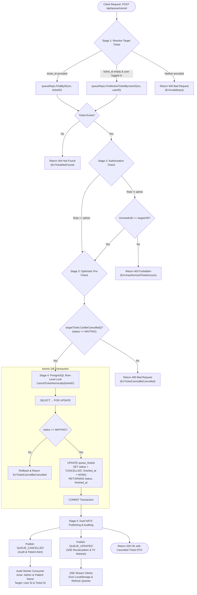

# Technical Specification: Queue Engine & Real-Time Wait Calculation
**File:** `docs/tech/02-queue-calculator-tech.md`  
**Status:** Approved  
**Version:** `v1.6.0`

---

## 1. Engineering Definition

The Queue Engine provides deterministic, multi-server queue scheduling using a **Greedy Earliest-Available-First Dispatch Algorithm**. It calculates minute-accurate estimated waiting times and streams state transitions to clients via **Server-Sent Events (SSE)** driven by **NATS JetStream**.

---

## 2. Algorithm Mechanism & Logic Flow

### 2.1 Greedy Multi-Doctor Simulation Logic


### 2.2 Core Algorithm Implementation (Go 1.27)

```go
type DoctorSlot struct {
    Doctor            *Doctor
    NextAvailableTime int
}

func CalculateEstimatedWaitingTime(doctors []*Doctor, positionInQueue int) (int, error) {
    if len(doctors) == 0 {
        return 0, ErrEmptyDoctors
    }
    if positionInQueue <= 1 {
        return 0, nil
    }

    slots := make([]*DoctorSlot, len(doctors))
    for i, doc := range doctors {
        slots[i] = &DoctorSlot{
            Doctor:            doc,
            NextAvailableTime: doc.CurrentSession.RemainingTime(doc.AvgConsultationTime),
        }
    }

    patientsAhead := positionInQueue - 1
    for range patientsAhead {
        slices.SortFunc(slots, func(a, b *DoctorSlot) int {
            if n := cmp.Compare(a.NextAvailableTime, b.NextAvailableTime); n != 0 {
                return n
            }
            return cmp.Compare(a.Doctor.AvgConsultationTime, b.Doctor.AvgConsultationTime)
        })
        slots[0].NextAvailableTime += slots[0].Doctor.AvgConsultationTime
    }

    slices.SortFunc(slots, func(a, b *DoctorSlot) int {
        return cmp.Compare(a.NextAvailableTime, b.NextAvailableTime)
    })

    return slots[0].NextAvailableTime, nil
}
```

### 2.3 Ticket Cancellation Architecture & Execution Flow (`CancelTicket`)

The ticket cancellation mechanism allows waiting patients or clinic administrators to safely relinquish an active queue reservation. The system guarantees atomicity, role-based authorization, race-condition immunity against concurrent doctor dispatch calls, and instant downstream state invalidation.



#### Execution Stages Breakdown:

1. **Stage 1: Input Sanitization & Active Ticket Resolution**
   - If `ticket_id` is passed, the target ticket is resolved directly via `FindByID(ctx, ticketID)`.
   - If `ticket_id` is empty and the caller is an authenticated patient, the active waiting reservation is dynamically resolved via `FindActiveTicketByUserID(ctx, userID)`.
   - Returns `domain.ErrTicketNotFound` if no record matches or `domain.ErrInvalidInput` if neither identifier is present.

2. **Stage 2: Linear Authorization Check (KISS / DRY Pattern)**
   - Role `admin` possesses universal cancellation privileges.
   - For role `patient`, both caller's `userID` and ticket's `UserID` are normalized (trimmed). The system asserts `trimmedUID == targetUID`. If a patient attempts to cancel another patient's ticket, it halts with `domain.ErrUnauthorizedTicketAccess` (mapped to HTTP `403 Forbidden`).

3. **Stage 3: Optimistic Status Pre-Check**
   - The in-memory domain entity validates `targetTicket.CanBeCancelled()` (`status == domain.StatusWaiting`).
   - If the ticket is already `IN_CONSULTATION`, `COMPLETED`, or `CANCELLED`, the UseCase terminates early without consuming database transaction connections or lock resources.

4. **Stage 4: Pessimistic Row-Level Locking in PostgreSQL (`CancelTicketAtomically`)**
   - Opens a dedicated transaction (`tx.Begin`).
   - Executes `SELECT ... FROM queue_tickets WHERE id = $1 FOR UPDATE` to serialize access with attending doctor calls.
   - Re-evaluates `CanBeCancelled()` inside the transaction snapshot to guarantee that a doctor hasn't simultaneously transitioned the ticket.
   - Executes `UPDATE queue_tickets SET status = 'CANCELLED', finished_at = NOW() WHERE id = $1 RETURNING status, finished_at`.
   - Commits the transaction, ensuring database-level ACID compliance.

5. **Stage 5: Post-Commit Dual Event Emission & Audit Persistence**
   - Dual NATS event emission:
     - `QUEUE_CANCELLED`: Carries full operational metadata (`ticket_id`, `queue_number`, `patient_name`, `user_id`, `cancelled_by`, `role`, `reason`).
     - `QUEUE_UPDATED`: Triggers real-time SSE broadcast to refresh TV dashboard, doctor workspace, and patient waiting position recalculations.
   - Asynchronous JetStream `AuditWorker` logs the action with high audit fidelity:
     - If cancelled by an Admin: `ActorName = "Clinic Administrator"`, `UserID = cancelled_by`, while retaining patient identity and ticket reference in `details`.
     - If cancelled by a Patient: `ActorName = patient_name`, `UserID = user_id`.

#### Concurrency & Race-Condition Defense (Doctor Call vs. Patient Cancel):
- **Doctor Dispatching Next Ticket:** Doctor calls use `SELECT ... FROM queue_tickets WHERE status = 'WAITING' ORDER BY created_at ASC LIMIT 1 FOR UPDATE SKIP LOCKED`.
- **Case 1 (Doctor Acquires Lock First):** The doctor locks the row and sets `status = 'IN_CONSULTATION'`. The patient's `CancelTicketAtomically` blocks on `FOR UPDATE`. Once unlocked, the patient reads `status = 'IN_CONSULTATION'`, fails `CanBeCancelled()`, rolls back, and returns `ErrTicketCannotBeCancelled` (HTTP 400).
- **Case 2 (Patient Acquires Lock First):** The patient locks the row and transitions status to `'CANCELLED'`. The doctor's `SKIP LOCKED` query skips the row immediately, or if evaluated after commit, filters it out because `status != 'WAITING'`.
- **Result:** Zero deadlock probability, zero corrupted states, and deterministic behavior under extreme concurrent load.

#### Idiomatic Implementation Snippet (`internal/core/usecase/queue_usecase.go`):

```go
func (u *QueueUseCase) CancelTicket(ctx context.Context, userID *string, userRole string, ticketID string, reason string) (*domain.QueueTicket, error) {
    trimmedTicketID := strings.TrimSpace(ticketID)
    var trimmedUID string
    if userID != nil {
        trimmedUID = strings.TrimSpace(*userID)
    }

    var targetTicket *domain.QueueTicket
    var err error

    if trimmedTicketID != "" {
        targetTicket, err = u.queueRepo.FindByID(ctx, trimmedTicketID)
        if err != nil {
            return nil, fmt.Errorf("find ticket by id %s: %w", trimmedTicketID, err)
        }
        if targetTicket == nil {
            return nil, domain.ErrTicketNotFound
        }
    } else if trimmedUID != "" {
        targetTicket, err = u.queueRepo.FindActiveTicketByUserID(ctx, trimmedUID)
        if err != nil {
            return nil, fmt.Errorf("find active ticket for user %s: %w", trimmedUID, err)
        }
        if targetTicket == nil {
            return nil, domain.ErrTicketNotFound
        }
    } else {
        return nil, domain.ErrInvalidInput
    }

    if userRole != string(domain.RoleAdmin) {
        var targetUID string
        if targetTicket.UserID != nil {
            targetUID = strings.TrimSpace(*targetTicket.UserID)
        }
        if trimmedUID != targetUID {
            return nil, domain.ErrUnauthorizedTicketAccess
        }
    }

    if !targetTicket.CanBeCancelled() {
        return nil, domain.ErrTicketCannotBeCancelled
    }

    cancelledTicket, err := u.queueRepo.CancelTicketAtomically(ctx, targetTicket.ID)
    if err != nil {
        return nil, fmt.Errorf("cancel ticket atomically: %w", err)
    }

    if u.eventPub != nil {
        var cancelledBy *string
        if trimmedUID != "" {
            cancelledBy = &trimmedUID
        }

        _ = u.eventPub.PublishEvent(ctx, "QUEUE_CANCELLED", map[string]any{
            "ticket_id":     cancelledTicket.ID,
            "queue_number":  cancelledTicket.QueueNumber,
            "patient_name":  cancelledTicket.PatientName,
            "user_id":       cancelledTicket.UserID,
            "cancelled_by":  cancelledBy,
            "role":          userRole,
            "reason":        strings.TrimSpace(reason),
        })

        _ = u.eventPub.PublishEvent(ctx, "QUEUE_UPDATED", map[string]any{
            "action":       "QUEUE_CANCELLED",
            "ticket_id":    cancelledTicket.ID,
            "queue_number": cancelledTicket.QueueNumber,
            "patient_name": cancelledTicket.PatientName,
        })
    }

    return cancelledTicket, nil
}
```

---

## 3. Database Migration (Goose SQL)

```sql
-- +goose Up
CREATE TABLE IF NOT EXISTS queue_tickets (
    id UUID PRIMARY KEY DEFAULT uuidv7(),
    user_id UUID REFERENCES users(id) ON DELETE SET NULL,
    patient_name VARCHAR(100) NOT NULL,
    queue_number VARCHAR(20) NOT NULL,
    status VARCHAR(30) NOT NULL DEFAULT 'WAITING' 
        CHECK (status IN ('WAITING', 'IN_CONSULTATION', 'COMPLETED', 'CANCELLED')),
    created_at TIMESTAMP WITH TIME ZONE DEFAULT NOW(),
    called_at TIMESTAMP WITH TIME ZONE,
    finished_at TIMESTAMP WITH TIME ZONE
);

CREATE INDEX IF NOT EXISTS idx_queue_tickets_status ON queue_tickets(status);
CREATE INDEX IF NOT EXISTS idx_queue_tickets_created_at ON queue_tickets(created_at);

-- +goose Down
DROP TABLE IF EXISTS queue_tickets;
```

---

## 4. API Specification

### 4.1 Join Queue
- **URL:** `POST /api/queue/join`
- **Access:** Role `patient`
- **Request Body:**
```json
{
  "patient_name": "John Doe"
}
```
- **Response (201 Created):**
```json
{
  "ticket": {
    "id": "01919df4-8e3b-7412-a1f9-90b567c9e301",
    "queue_number": "A-11",
    "patient_name": "John Doe",
    "status": "WAITING",
    "position_in_queue": 11,
    "ahead_count": 10,
    "estimated_wait_time_minutes": 16,
    "created_at": "2026-08-29T10:00:00Z"
  }
}
```

### 4.2 Public Queue & Clinic Status
- **URL:** `GET /api/queue/status`
- **Access:** Public
- **Response (200 OK):**
```json
{
  "online_doctors": [
    { "id": "01919df4-8e3b-7412-a1f9-90b567c9e201", "name": "Doctor A", "avg_time": 3, "status": "AVAILABLE" },
    { "id": "01919df4-8e3b-7412-a1f9-90b567c9e202", "name": "Doctor B", "avg_time": 4, "status": "IN_CONSULTATION", "current_patient": "Lucas", "elapsed_minutes": 2 }
  ],
  "total_waiting": 9,
  "queue_list": [
    { "queue_number": "A-01", "patient_name": "Alice", "estimated_wait_minutes": 0 },
    { "queue_number": "A-02", "patient_name": "Bob", "estimated_wait_minutes": 3 }
  ]
}
```

### 4.3 Real-Time SSE Stream
- **URL:** `GET /api/events`
- **Protocol:** Server-Sent Events (`text/event-stream`)
- **Event Example:**
```text
data: {"type":"QUEUE_UPDATED","data":{"doctor_id":"01919df4-8e3b-7412-a1f9-90b567c9e101","doctor_name":"Dr. Sarah Adams","is_online":true,"status":"AVAILABLE"},"timestamp":"2026-08-30T06:24:09Z"}
```

### 4.4 Cancel Queue Ticket
- **URL:** `POST /api/queue/cancel`
- **Access:** Role `patient`, `admin`
- **Request Body (JSON):**
```json
{
  "ticket_id": "01919df4-8e3b-7412-a1f9-90b567c9e301",
  "reason": "Change of plans"
}
```
*(Note: `ticket_id` is optional for authenticated patients; if omitted, the user's active waiting ticket is resolved automatically from the JWT context).*
- **Response (200 OK):**
```json
{
  "message": "Queue ticket successfully cancelled",
  "ticket": {
    "id": "01919df4-8e3b-7412-a1f9-90b567c9e301",
    "queue_number": "A-11",
    "patient_name": "John Doe",
    "status": "CANCELLED",
    "created_at": "2026-08-29T10:00:00Z",
    "finished_at": "2026-08-29T10:05:00Z"
  }
}
```

---

## 5. API Case Scenarios

| Scenario ID | Endpoint | Method | Condition / Payload | Status | Response Summary |
| :--- | :--- | :---: | :--- | :---: | :--- |
| **API-QUE-01** | `/api/queue/join` | `POST` | Valid Name ("John") | `201 Created` | Returns Ticket A-11 with Wait Time 16m and UUIDv7 ID |
| **API-QUE-02** | `/api/queue/join` | `POST` | Empty Name `""` | `400 Bad Request` | `{"error": "Patient name is required"}` |
| **API-QUE-03** | `/api/queue/join` | `POST` | Already has active ticket | `409 Conflict` | `{"error": "Active queue ticket already exists"}` |
| **API-QUE-04** | `/api/queue/status`| `GET` | All doctors offline | `200 OK` | Returns `online_doctors: []`, `notice: "Doctors offline"` |
| **API-QUE-05** | `/api/queue/cancel`| `POST` | Valid ticket in WAITING | `200 OK` | Ticket cancelled, events broadcasted |
| **API-QUE-06** | `/api/queue/cancel`| `POST` | Ticket IN_CONSULTATION | `400 Bad Request` | `{"error": "Ticket cannot be cancelled in its current state"}` |
| **API-QUE-07** | `/api/queue/cancel`| `POST` | Unauthorized patient | `403 Forbidden` | `{"error": "You are not authorized to cancel this ticket"}` |

---

## 6. Document Revision History & Requirement Changelog

| Version | Date | Author / Role | Change Type | Change Summary / Rationale |
| :---: | :---: | :---: | :---: | :--- |
| **v1.0.0** | 2026-08-29 | Backend Lead | **Initial Baseline** | Initial technical specification for the greedy multi-doctor queue algorithm, Goose SQL migration for `queue_tickets`, REST API endpoints, and NATS-backed SSE stream specs. |
| **v1.1.0** | 2026-08-30 | Backend Lead | **Native UUIDv7 Spec** | Migrated `queue_tickets.id`, `queue_tickets.user_id`, and `DoctorAvailability.ID` to Native UUIDv7 (`DEFAULT uuidv7()`), updating domain entities, DTOs, and test assertions. |
| **v1.2.0** | 2026-08-30 | Backend Lead | **Standard SSE Data Envelope** | Standardized SSE broadcaster to standard `data:` envelope with dual `Type`/`Event` attributes for 100% browser `EventSource.onmessage` compatibility. |
| **v1.3.0** | 2026-08-30 | Backend Lead | **Dual Queue Event Emission** | Added dual `QUEUE_JOINED` and `QUEUE_UPDATED` NATS event emission on `JoinQueue` to trigger sub-second real-time patient admissions across idle doctor workspaces. |
| **v1.4.0** | 2026-08-30 | Backend Lead | **Clean Envelope Standardization** | Standardized event envelope across Go backend and SSE stream to canonical single `type` field, eliminating redundant key duplication. |
| **v1.5.0** | 2026-09-12 | Backend Lead | **Queue Ticket Cancellation API** | Added `POST /api/queue/cancel` technical spec with row-level lock concurrency control (`SELECT ... FOR UPDATE`), dual event publishing (`QUEUE_CANCELLED` and `QUEUE_UPDATED`), and audit trail persistence. |
| **v1.6.0** | 2026-09-12 | Backend Lead | **Cancellation Architecture & Flow Spec** | Documented Section 2.3 `Ticket Cancellation Architecture & Execution Flow (CancelTicket)`: 5-stage lifecycle, Mermaid flowchart, linear authorization check, concurrency safety guarantees against doctor calls, and Go 1.27 implementation. |

