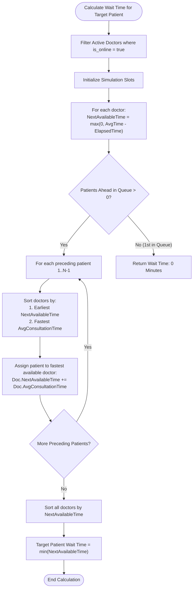

# Technical Specification: Queue Engine & Real-Time Wait Calculation
**File:** `docs/tech/02-queue-calculator-tech.md`  
**Status:** Approved  
**Version:** `v1.1.0`

---

## 1. Engineering Definition

The Queue Engine provides deterministic, multi-server queue scheduling using a **Greedy Earliest-Available-First Dispatch Algorithm**. It calculates minute-accurate estimated waiting times and streams state transitions to clients via **Server-Sent Events (SSE)** driven by **NATS JetStream**.

---

## 2. Algorithm Mechanism & Logic Flow

### 2.1 Greedy Multi-Doctor Simulation Logic



### 2.2 Core Algorithm Implementation (Go 1.27)

```go
type DoctorSlot struct {
    Doctor            *Doctor
    NextAvailableTime int
}

func CalculateEstimatedWaitingTime(doctors []*Doctor, positionInQueue int) (int, error) {
    if len(doctors) == 0 {
        return 0, ErrEmptyDoctors
    }
    if positionInQueue <= 1 {
        return 0, nil
    }

    slots := make([]*DoctorSlot, len(doctors))
    for i, doc := range doctors {
        slots[i] = &DoctorSlot{
            Doctor:            doc,
            NextAvailableTime: doc.CurrentSession.RemainingTime(doc.AvgConsultationTime),
        }
    }

    patientsAhead := positionInQueue - 1
    for range patientsAhead {
        slices.SortFunc(slots, func(a, b *DoctorSlot) int {
            if n := cmp.Compare(a.NextAvailableTime, b.NextAvailableTime); n != 0 {
                return n
            }
            return cmp.Compare(a.Doctor.AvgConsultationTime, b.Doctor.AvgConsultationTime)
        })
        slots[0].NextAvailableTime += slots[0].Doctor.AvgConsultationTime
    }

    slices.SortFunc(slots, func(a, b *DoctorSlot) int {
        return cmp.Compare(a.NextAvailableTime, b.NextAvailableTime)
    })

    return slots[0].NextAvailableTime, nil
}
```

---

## 3. Database Migration (Goose SQL)

```sql
-- +goose Up
CREATE TABLE IF NOT EXISTS queue_tickets (
    id UUID PRIMARY KEY DEFAULT uuidv7(),
    user_id UUID REFERENCES users(id) ON DELETE SET NULL,
    patient_name VARCHAR(100) NOT NULL,
    queue_number VARCHAR(20) NOT NULL,
    status VARCHAR(30) NOT NULL DEFAULT 'WAITING' 
        CHECK (status IN ('WAITING', 'IN_CONSULTATION', 'COMPLETED', 'CANCELLED')),
    created_at TIMESTAMP WITH TIME ZONE DEFAULT NOW(),
    called_at TIMESTAMP WITH TIME ZONE,
    finished_at TIMESTAMP WITH TIME ZONE
);

CREATE INDEX IF NOT EXISTS idx_queue_tickets_status ON queue_tickets(status);
CREATE INDEX IF NOT EXISTS idx_queue_tickets_created_at ON queue_tickets(created_at);

-- +goose Down
DROP TABLE IF EXISTS queue_tickets;
```

---

## 4. API Specification

### 4.1 Join Queue
- **URL:** `POST /api/queue/join`
- **Access:** Role `patient`
- **Request Body:**
```json
{
  "patient_name": "John Doe"
}
```
- **Response (201 Created):**
```json
{
  "ticket": {
    "id": "01919df4-8e3b-7412-a1f9-90b567c9e301",
    "queue_number": "A-11",
    "patient_name": "John Doe",
    "status": "WAITING",
    "position_in_queue": 11,
    "ahead_count": 10,
    "estimated_wait_time_minutes": 16,
    "created_at": "2026-08-29T10:00:00Z"
  }
}
```

### 4.2 Public Queue & Clinic Status
- **URL:** `GET /api/queue/status`
- **Access:** Public
- **Response (200 OK):**
```json
{
  "online_doctors": [
    { "id": "01919df4-8e3b-7412-a1f9-90b567c9e201", "name": "Doctor A", "avg_time": 3, "status": "AVAILABLE" },
    { "id": "01919df4-8e3b-7412-a1f9-90b567c9e202", "name": "Doctor B", "avg_time": 4, "status": "IN_CONSULTATION", "current_patient": "Lucas", "elapsed_minutes": 2 }
  ],
  "total_waiting": 9,
  "queue_list": [
    { "queue_number": "A-01", "patient_name": "Alice", "estimated_wait_minutes": 0 },
    { "queue_number": "A-02", "patient_name": "Bob", "estimated_wait_minutes": 3 }
  ]
}
```

### 4.3 Real-Time SSE Stream
- **URL:** `GET /api/events`
- **Protocol:** Server-Sent Events (`text/event-stream`)
- **Event Example:**
```text
data: {"type":"QUEUE_UPDATED","data":{"doctor_id":"01919df4-8e3b-7412-a1f9-90b567c9e101","doctor_name":"Dr. Sarah Adams","is_online":true,"status":"AVAILABLE"},"timestamp":"2026-08-30T06:24:09Z"}
```

---

## 5. API Case Scenarios

| Scenario ID | Endpoint | Method | Condition / Payload | Status | Response Summary |
| :--- | :--- | :---: | :--- | :---: | :--- |
| **API-QUE-01** | `/api/queue/join` | `POST` | Valid Name ("John") | `201 Created` | Returns Ticket A-11 with Wait Time 16m and UUIDv7 ID |
| **API-QUE-02** | `/api/queue/join` | `POST` | Empty Name `""` | `400 Bad Request` | `{"error": "Patient name is required"}` |
| **API-QUE-03** | `/api/queue/join` | `POST` | Already has active ticket | `409 Conflict` | `{"error": "Active queue ticket already exists"}` |
| **API-QUE-04** | `/api/queue/status`| `GET` | All doctors offline | `200 OK` | Returns `online_doctors: []`, `notice: "Doctors offline"` |

---

## 6. Document Revision History & Requirement Changelog

| Version | Date | Author / Role | Change Type | Change Summary / Rationale |
| :---: | :---: | :---: | :---: | :--- |
| **v1.0.0** | 2026-08-29 | Backend Lead | **Initial Baseline** | Initial technical specification for the greedy multi-doctor queue algorithm, Goose SQL migration for `queue_tickets`, REST API endpoints, and NATS-backed SSE stream specs. |
| **v1.1.0** | 2026-08-30 | Backend Lead | **Native UUIDv7 Spec** | Migrated `queue_tickets.id`, `queue_tickets.user_id`, and `DoctorAvailability.ID` to Native UUIDv7 (`DEFAULT uuidv7()`), updating domain entities, DTOs, and test assertions. |
| **v1.2.0** | 2026-08-30 | Backend Lead | **Standard SSE Data Envelope** | Standardized SSE broadcaster to standard `data:` envelope with dual `Type`/`Event` attributes for 100% browser `EventSource.onmessage` compatibility. |
| **v1.3.0** | 2026-08-30 | Backend Lead | **Dual Queue Event Emission** | Added dual `QUEUE_JOINED` and `QUEUE_UPDATED` NATS event emission on `JoinQueue` to trigger sub-second real-time patient admissions across idle doctor workspaces. |
| **v1.4.0** | 2026-08-30 | Backend Lead | **Clean Envelope Standardization** | Standardized event envelope across Go backend and SSE stream to canonical single `type` field, eliminating redundant key duplication. |
