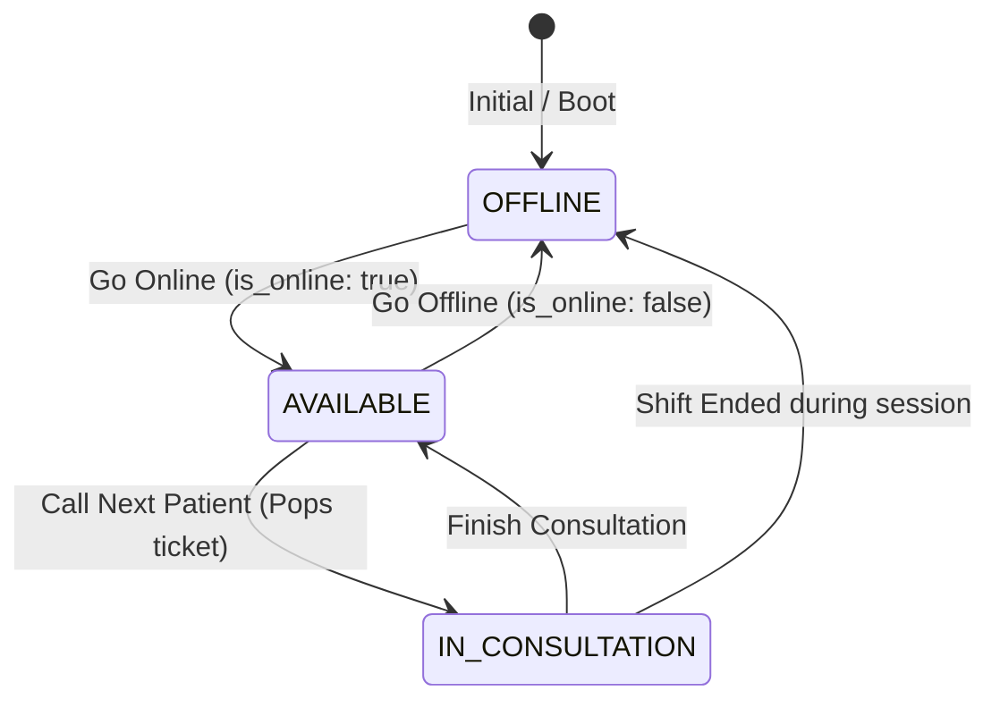

# Technical Specification: Doctor Workspace & Consultation Workflow
**File:** `docs/tech/03-doctor-workspace-tech.md`  
**Status:** Approved  
**Version:** `v1.1.0`

---

## 1. Engineering Definition

The Doctor Workspace handles doctor shift transitions (`ONLINE` vs `OFFLINE`), concurrency-safe patient admissions from the queue, live consultation duration tracking, and consultation completion events that trigger **NATS JetStream broadcasts**.

---

## 2. Architecture & State Transition Machine

### 2.1 Doctor Room State Machine



### 2.2 Atomic Concurrency Control on "Call Next"

To prevent race conditions where two doctors simultaneously call the same patient, the admission query uses **PostgreSQL row locking**:

```sql
-- Executed inside a single Serializable / Read-Committed Transaction:
BEGIN;

-- 1. Lock the earliest waiting ticket
SELECT id, patient_name 
FROM queue_tickets 
WHERE status = 'WAITING' 
ORDER BY id ASC 
LIMIT 1 
FOR UPDATE SKIP LOCKED;

-- 2. Update ticket status
UPDATE queue_tickets 
SET status = 'IN_CONSULTATION', called_at = NOW() 
WHERE id = $1;

-- 3. Create active consultation session
INSERT INTO consultation_sessions (doctor_id, ticket_id, patient_name, started_at, is_active)
VALUES ($2, $1, $3, NOW(), TRUE);

COMMIT;
```

---

## 3. Database Migration (Goose SQL)

```sql
-- +goose Up
CREATE TABLE IF NOT EXISTS doctors (
    id UUID PRIMARY KEY DEFAULT uuidv7(),
    name VARCHAR(100) NOT NULL,
    avg_consultation_time_min INT NOT NULL CHECK (avg_consultation_time_min > 0),
    is_online BOOLEAN NOT NULL DEFAULT FALSE,
    created_at TIMESTAMP WITH TIME ZONE DEFAULT NOW(),
    updated_at TIMESTAMP WITH TIME ZONE DEFAULT NOW()
);

CREATE TABLE IF NOT EXISTS consultation_sessions (
    id UUID PRIMARY KEY DEFAULT uuidv7(),
    doctor_id UUID NOT NULL REFERENCES doctors(id) ON DELETE CASCADE,
    ticket_id UUID NOT NULL REFERENCES queue_tickets(id) ON DELETE CASCADE,
    patient_name VARCHAR(100) NOT NULL,
    started_at TIMESTAMP WITH TIME ZONE NOT NULL DEFAULT NOW(),
    finished_at TIMESTAMP WITH TIME ZONE,
    is_active BOOLEAN NOT NULL DEFAULT TRUE
);

CREATE INDEX IF NOT EXISTS idx_sessions_doctor_active ON consultation_sessions(doctor_id, is_active);

-- +goose Down
DROP TABLE IF EXISTS consultation_sessions;
DROP TABLE IF EXISTS doctors;
```

---

## 4. API Specification

### 4.1 Toggle Doctor Shift Status
- **URL:** `POST /api/doctors/status`
- **Access:** Role `doctor`
- **Request Body:**
```json
{
  "is_online": true
}
```
- **Response (200 OK):**
```json
{
  "doctor_id": "01919df4-8e3b-7412-a1f9-90b567c9e201",
  "name": "Doctor A",
  "is_online": true,
  "status": "AVAILABLE"
}
```

### 4.2 Call Next Patient
- **URL:** `POST /api/doctors/call-next`
- **Access:** Role `doctor`
- **Response (200 OK):**
```json
{
  "session_id": "01919df4-8e3b-7412-a1f9-90b567c9e401",
  "doctor_id": "01919df4-8e3b-7412-a1f9-90b567c9e201",
  "ticket": {
    "id": "01919df4-8e3b-7412-a1f9-90b567c9e301",
    "queue_number": "A-01",
    "patient_name": "Alice",
    "status": "IN_CONSULTATION"
  },
  "started_at": "2026-08-29T10:00:00Z"
}
```

### 4.3 Finish Consultation
- **URL:** `POST /api/doctors/finish`
- **Access:** Role `doctor`
- **Response (200 OK):**
```json
{
  "session_id": "01919df4-8e3b-7412-a1f9-90b567c9e401",
  "patient_name": "Alice",
  "actual_duration_minutes": 3.2,
  "finished_at": "2026-08-29T10:03:12Z",
  "doctor_status": "AVAILABLE"
}
```

---

## 5. API Case Scenarios

| Scenario ID | Endpoint | Method | Condition | Status | Response Summary |
| :--- | :--- | :---: | :--- | :---: | :--- |
| **API-DOC-01** | `/api/doctors/status` | `POST` | Toggle to `true` | `200 OK` | Doctor is online & available (UUIDv7) |
| **API-DOC-02** | `/api/doctors/call-next` | `POST` | 1 patient waiting | `200 OK` | Patient popped, session active with UUIDv7 IDs |
| **API-DOC-03** | `/api/doctors/call-next` | `POST` | 0 patients waiting | `200 OK` | `{"message": "Queue is empty"}` |
| **API-DOC-04** | `/api/doctors/call-next` | `POST` | Doctor is offline | `400 Bad Request` | `{"error": "Doctor must be online"}` |
| **API-DOC-05** | `/api/doctors/call-next` | `POST` | Already in session | `409 Conflict` | `{"error": "Active session in progress"}` |
| **API-DOC-06** | `/api/doctors/finish` | `POST` | No active session | `400 Bad Request` | `{"error": "No active session to finish"}` |

---

## 6. Document Revision History & Requirement Changelog

| Version | Date | Author / Role | Change Type | Change Summary / Rationale |
| :---: | :---: | :---: | :---: | :--- |
| **v1.0.0** | 2026-08-29 | Backend Lead | **Initial Baseline** | Initial technical specification for doctor shift lifecycle, atomic `FOR UPDATE SKIP LOCKED` concurrency control, Goose SQL migrations, and REST endpoints. |
| **v1.1.0** | 2026-08-30 | Backend Lead | **Native UUIDv7 Spec** | Migrated `doctors.id` and `consultation_sessions.id` to Native UUIDv7 (`DEFAULT uuidv7()`), updating domain entities, concurrency query bindings, and DTO structures. |
