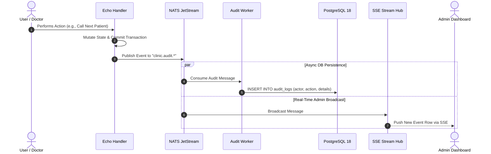

# Technical Specification: Comprehensive Activity Logging & Audit Trail
**File:** `docs/tech/05-audit-trail-tech.md`  
**Status:** Approved  
**Version:** `v1.3.0`

---

## 1. Engineering Definition

The Audit Trail subsystem implements an asynchronous, append-only event logging pipeline that captures forensic and operational events into **PostgreSQL 18 JSONB storage** and broadcasts them in real time to administrators via **Server-Sent Events (SSE)**.

---

## 2. Architecture & Pipeline Flow



---

## 3. Database Migration (Goose SQL)

```sql
-- +goose Up
CREATE TABLE IF NOT EXISTS audit_logs (
    id UUID PRIMARY KEY DEFAULT uuidv7(),
    user_id UUID REFERENCES users(id) ON DELETE SET NULL,
    actor_name VARCHAR(100) NOT NULL,
    role VARCHAR(20) NOT NULL,
    action VARCHAR(50) NOT NULL,
    details JSONB DEFAULT '{}'::jsonb,
    ip_address VARCHAR(45),
    created_at TIMESTAMP WITH TIME ZONE DEFAULT NOW()
);

-- B-Tree index for sorting and filtering by action & timestamp
CREATE INDEX IF NOT EXISTS idx_audit_logs_action_created ON audit_logs(action, created_at DESC);

-- GIN index for fast JSONB querying inside details payload
CREATE INDEX IF NOT EXISTS idx_audit_logs_details_gin ON audit_logs USING GIN (details);

-- +goose Down
DROP TABLE IF EXISTS audit_logs;
```

---

## 4. API Specification

### 4.1 Query Audit Logs (Cursor-Paginated, Filterable & Sortable)
- **URL:** `GET /api/admin/audit-logs`
- **Access:** Role `admin` (Protected by JWT & Casbin RBAC)
- **Query Parameters:**
  - `search` (optional string, case-insensitive keyword across `actor_name`, `ip_address`, `action`)
  - `action` (optional string, e.g., `CONSULTATION_FINISHED`, `QUEUE_JOINED`)
  - `role` (optional string, e.g., `doctor`, `patient`, `admin`)
  - `user_id` (optional string, exact UUIDv7 match)
  - `from` / `start_date` (optional RFC3339 / ISO date string, e.g., `2026-08-30` or `2026-08-30T00:00:00Z`)
  - `to` / `end_date` (optional RFC3339 / ISO date string, e.g., `2026-08-30` or `2026-08-30T23:59:59Z`)
  - `order` / `sort_order` (optional string, `"desc"` [default, Newest First] or `"asc"` [Oldest First])
  - `cursor` (optional string, UUIDv7 of last seen record)
  - `limit` (integer, default: 15, max: 100)
- **Response (200 OK):**
```json
{
  "limit": 15,
  "next_cursor": "01919df4-8e3b-7412-a1f9-90b567c9e521",
  "has_more": true,
  "total_records": 154,
  "total_pages": 11,
  "logs": [
    {
      "id": "01919df4-8e3b-7412-a1f9-90b567c9e536",
      "user_id": "01919df4-8e3b-7412-a1f9-90b567c9e102",
      "actor_name": "Dr. Michael Chen",
      "role": "doctor",
      "action": "CONSULTATION_FINISHED",
      "details": {
        "actual_duration_minutes": 3.2,
        "doctor_id": "01919df4-8e3b-7412-a1f9-90b567c9e202",
        "doctor_name": "Dr. Michael Chen",
        "patient_name": "Lucas Smith",
        "session_id": "01919df4-8e3b-7412-a1f9-90b567c9e410"
      },
      "ip_address": "127.0.0.1",
      "created_at": "2026-08-30T06:49:40Z"
    }
  ]
}
```

---

## 5. API Case Scenarios

| Scenario ID | Endpoint | Method | Query / Payload | Status | Response Summary |
| :--- | :--- | :---: | :--- | :---: | :--- |
| **API-AUD-01** | `/api/admin/audit-logs` | `GET` | `?limit=15` | `200 OK` | Returns initial cursor page with UUIDv7 `next_cursor` & `has_more` |
| **API-AUD-02** | `/api/admin/audit-logs` | `GET` | `?cursor=UUIDv7&limit=15` | `200 OK` | Returns next slice without pagination drift |
| **API-AUD-03** | `/api/admin/audit-logs` | `GET` | `?search=Michael` | `200 OK` | Returns activity logs matching keyword across actor/action/IP |
| **API-AUD-04** | `/api/admin/audit-logs` | `GET` | `?order=asc&limit=15` | `200 OK` | Returns oldest logs first (`WHERE id > $cursor ORDER BY id ASC`) |
| **API-AUD-05** | `/api/admin/audit-logs` | `GET` | `?from=2026-08-01&to=2026-08-30` | `200 OK` | Filtered list within date range |
| **API-AUD-06** | `/api/admin/audit-logs` | `GET` | Non-admin token | `403 Forbidden` | `{"error": "Access denied: admin role required"}` |
| **API-AUD-07** | `/api/admin/audit-logs` | `POST/PUT/DELETE` | Any mutation attempt | `405 Method Not Allowed` | Read-only & append-only via events |

---

## 6. Document Revision History & Requirement Changelog

| Version | Date | Author / Role | Change Type | Change Summary / Rationale |
| :---: | :---: | :---: | :---: | :--- |
| **v1.0.0** | 2026-08-29 | Backend Lead | **Initial Baseline** | Initial technical specification for asynchronous audit logging pipeline, GIN-indexed JSONB storage in PostgreSQL 18, and filterable paginated REST API. |
| **v1.1.0** | 2026-08-30 | Lead Backend Architect | **Architecture Enhancement** | Upgraded to Cursor Pagination engine, added `next_cursor` and `has_more` response metadata, and integrated NATS JetStream `AuditWorker` event ingestion. |
| **v1.2.0** | 2026-08-30 | Lead Backend Architect | **Feature Enhancement** | Added keyword search (`search`), Date Range filtering (`start_date`, `end_date`), and bidirectional cursor sorting (`order=asc/desc`). |
| **v1.3.0** | 2026-08-30 | Lead Backend Architect | **Native UUIDv7 Spec** | Migrated `audit_logs.id` and `audit_logs.user_id` to Native UUIDv7 (`DEFAULT uuidv7()`), updating cursor query bindings and JSON serialization. |
