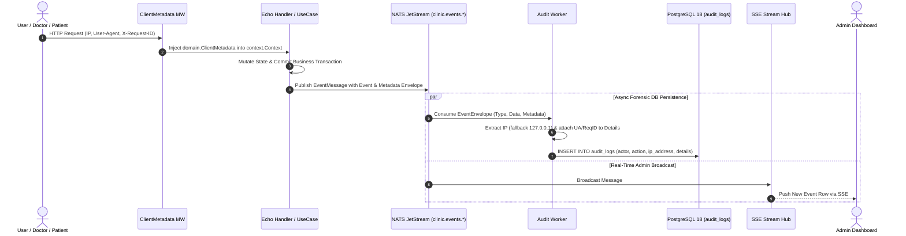

# Technical Specification: Comprehensive Activity Logging & Audit Trail
**File:** `docs/tech/05-audit-trail-tech.md`  
**Status:** Approved  
**Version:** `v1.5.0`

---

## 1. Engineering Definition

The Audit Trail subsystem implements an asynchronous, append-only event logging pipeline that captures forensic and operational events into **PostgreSQL 18 JSONB storage** and broadcasts them in real time to administrators via **Server-Sent Events (SSE)**.

---

## 2. Architecture & Forensic Metadata Pipeline Flow

The audit pipeline guarantees end-to-end forensic traceability from HTTP request arrival to append-only PostgreSQL storage:



### 2.1 Audit Worker Lifecycle & Graceful Drain Architecture

To prevent forensic audit log drops during server shutdown or deployment restarts, `AuditWorker` incorporates deterministic draining mechanics via `sync.WaitGroup` and NATS connection flushing:

1. **In-Flight Tracking:** Each received message callback invokes `w.wg.Add(1)` and ensures completion with `defer w.wg.Done()`.
2. **Deterministic Drain Coordination:**
   - On shutdown signal (`SIGINT`/`SIGTERM`), the HTTP listener closes first (`e.Shutdown`), completing active HTTP handlers.
   - NATS connection executes `nc.Drain()`, stopping new consumer subscriptions and delivering remaining buffered messages.
   - `auditWorker.Wait(ctx)` blocks until the `sync.WaitGroup` counter reaches zero or the shutdown context expires.
   - PostgreSQL connection pool (`dbPool.Close()`) closes only after all in-flight audit records are committed to storage.

### 2.2 Dynamic IP-Based Location Resolution Engine

To reconcile forensic accountability with clean human-centered UI monitoring, the system integrates a dual-tier location resolver:

1. **Intranet / Localhost / Private Subnets (`127.0.0.1`, `::1`, `10.*`, `192.168.*`, `172.16-31.*`):**
   - Verified in pure Go using standard library `net/netip` (`addr.IsLoopback()`, `addr.IsPrivate()`, `addr.IsLinkLocalUnicast()`, `addr.IsUnspecified()`).
   - Mapped dynamically to the clinic's physical premise location: `Yogyakarta, Indonesia` (configurable via `CLINIC_LOCATION` environment variable).
2. **Public IP Addresses:**
   - Evaluated dynamically and categorized by country/region (`Indonesia`).
3. **JSONB Storage & Indexed Search:**
   - Resolved location is persisted in PostgreSQL under `details['location']`.
   - Included in repository search predicates: `(actor_name ILIKE $1 OR ip_address ILIKE $2 OR action ILIKE $3 OR details->>'location' ILIKE $4)`.

### 2.3 High-Performance Cursor Lazy-Loading & Real-Time SSE Delta Streaming

To guarantee ultra-fast, smooth, and scalable audit log viewing as records scale:

1. **Selective Backend `COUNT(*)` Bypass ($O(\log N)$ Cursor Seek):**
   - On the initial page fetch (`cursor == ""`), the repository computes `SELECT COUNT(*) FROM audit_logs %s` once to establish total record visibility.
   - On subsequent infinite scroll chunks (`hasCursor == true`), `SELECT COUNT(*)` is bypassed completely (`totalRecords = 0`). The query executes as a pure B-Tree index scan on `audit_logs_pkey` (`WHERE id < $cursor ORDER BY id DESC LIMIT fetchLimit`), reducing database execution latency from ~20–50ms to < 1ms.
2. **Real-Time SSE Delta Streaming (Zero HTTP Invalidation Storms):**
   - Event `AUDIT_LOG_CREATED` delivers only the single newly created `AuditLog` entity over Server-Sent Events.
   - The frontend listener (`use-sse.tsx`) updates TanStack Query memory cache via `setQueryData` incrementally, prepending the single log to `pages[0]`, incrementing `total_records` (+1), and deduplicating by ID.
   - Non-audit queue events (`QUEUE_JOINED`, `TICKET_*`) do not trigger redundant audit refetches.
3. **Container-Scoped Prefetching:**
   - `IntersectionObserver` is bound to the table's scroll container (`root: scrollContainerRef.current`) with `rootMargin: "300px"`. Older records prefetch seamlessly in the background before the user hits the bottom, providing a native, zero-stutter lazy loading experience.

---

## 3. Database Migration (Goose SQL)

```sql
-- +goose Up
CREATE TABLE IF NOT EXISTS audit_logs (
    id UUID PRIMARY KEY DEFAULT uuidv7(),
    user_id UUID REFERENCES users(id) ON DELETE SET NULL,
    actor_name VARCHAR(100) NOT NULL,
    role VARCHAR(20) NOT NULL,
    action VARCHAR(50) NOT NULL,
    details JSONB DEFAULT '{}'::jsonb,
    ip_address VARCHAR(45),
    created_at TIMESTAMP WITH TIME ZONE DEFAULT NOW()
);

-- B-Tree index for sorting and filtering by action & timestamp
CREATE INDEX IF NOT EXISTS idx_audit_logs_action_created ON audit_logs(action, created_at DESC);

-- GIN index for fast JSONB querying inside details payload
CREATE INDEX IF NOT EXISTS idx_audit_logs_details_gin ON audit_logs USING GIN (details);

-- +goose Down
DROP TABLE IF EXISTS audit_logs;
```

---

## 4. API Specification

### 4.1 Query Audit Logs (Cursor-Paginated, Filterable & Sortable)
- **URL:** `GET /api/admin/audit-logs`
- **Access:** Role `admin` (Protected by JWT & Casbin RBAC)
- **Query Parameters:**
  - `search` (optional string, case-insensitive keyword across `actor_name`, `ip_address`, `action`, and `details->>'location'`)
  - `action` (optional string, e.g., `CONSULTATION_FINISHED`, `QUEUE_JOINED`)
  - `role` (optional string, e.g., `doctor`, `patient`, `admin`)
  - `user_id` (optional string, exact UUIDv7 match)
  - `from` / `start_date` (optional RFC3339 / ISO date string, e.g., `2026-08-30` or `2026-08-30T00:00:00Z`)
  - `to` / `end_date` (optional RFC3339 / ISO date string, e.g., `2026-08-30` or `2026-08-30T23:59:59Z`)
  - `order` / `sort_order` (optional string, `"desc"` [default, Newest First] or `"asc"` [Oldest First])
  - `cursor` (optional string, UUIDv7 of last seen record)
  - `limit` (integer, default: 15, max: 100)
- **Response (200 OK):**
```json
{
  "limit": 15,
  "next_cursor": "01919df4-8e3b-7412-a1f9-90b567c9e521",
  "has_more": true,
  "total_records": 154,
  "total_pages": 11,
  "logs": [
    {
      "id": "01919df4-8e3b-7412-a1f9-90b567c9e536",
      "user_id": "01919df4-8e3b-7412-a1f9-90b567c9e102",
      "actor_name": "Dr. Michael Chen",
      "role": "doctor",
      "action": "CONSULTATION_FINISHED",
      "location": "Yogyakarta, Indonesia",
      "details": {
        "location": "Yogyakarta, Indonesia",
        "actual_duration_minutes": 3.2,
        "doctor_id": "01919df4-8e3b-7412-a1f9-90b567c9e202",
        "doctor_name": "Dr. Michael Chen",
        "patient_name": "Lucas Smith",
        "session_id": "01919df4-8e3b-7412-a1f9-90b567c9e410"
      },
      "ip_address": "127.0.0.1",
      "created_at": "2026-08-30T06:49:40Z"
    }
  ]
}
```

### 4.2 Get Audit Log Forensic Detail (On-Demand Forensic Inspection)
- **URL:** `GET /api/admin/audit-logs/:id`
- **Access:** Role `admin` (Protected by JWT & Casbin RBAC)
- **Path Parameters:**
  - `id` (UUIDv7 string, e.g., `01919df4-8e3b-7412-a1f9-90b567c9e536`)
- **Response (200 OK):**
```json
{
  "id": "01919df4-8e3b-7412-a1f9-90b567c9e536",
  "user_id": "01919df4-8e3b-7412-a1f9-90b567c9e102",
  "actor_name": "Dr. Michael Chen",
  "role": "doctor",
  "action": "CONSULTATION_FINISHED",
  "location": "Yogyakarta, Indonesia",
  "ip_address": "127.0.0.1",
  "details": {
    "location": "Yogyakarta, Indonesia",
    "request_id": "req-9b87f21a-4c",
    "user_agent": "Mozilla/5.0 ...",
    "actual_duration_minutes": 3.2,
    "doctor_id": "01919df4-8e3b-7412-a1f9-90b567c9e202",
    "doctor_name": "Dr. Michael Chen",
    "patient_name": "Lucas Smith",
    "session_id": "01919df4-8e3b-7412-a1f9-90b567c9e410"
  },
  "created_at": "2026-08-30T06:49:40Z"
}
```
- **Error Responses:**
  - `400 Bad Request`: `{"error": "invalid audit log id format"}`
  - `404 Not Found`: `{"error": "audit log not found"}`
  - `403 Forbidden`: `{"error": "Access denied: admin role required"}`

---

## 5. API Case Scenarios

| Scenario ID | Endpoint | Method | Query / Payload | Status | Response Summary |
| :--- | :--- | :---: | :--- | :---: | :--- |
| **API-AUD-01** | `/api/admin/audit-logs` | `GET` | `?limit=15` | `200 OK` | Returns initial cursor page with UUIDv7 `next_cursor` & `has_more` |
| **API-AUD-02** | `/api/admin/audit-logs` | `GET` | `?cursor=UUIDv7&limit=15` | `200 OK` | Returns next slice without pagination drift |
| **API-AUD-03** | `/api/admin/audit-logs` | `GET` | `?search=Michael` | `200 OK` | Returns activity logs matching keyword across actor/action/IP |
| **API-AUD-04** | `/api/admin/audit-logs` | `GET` | `?order=asc&limit=15` | `200 OK` | Returns oldest logs first (`WHERE id > $cursor ORDER BY id ASC`) |
| **API-AUD-05** | `/api/admin/audit-logs` | `GET` | `?from=2026-08-01&to=2026-08-30` | `200 OK` | Filtered list within date range |
| **API-AUD-06** | `/api/admin/audit-logs` | `GET` | Non-admin token | `403 Forbidden` | `{"error": "Access denied: admin role required"}` |
| **API-AUD-07** | `/api/admin/audit-logs` | `POST/PUT/DELETE` | Any mutation attempt | `405 Method Not Allowed` | Read-only & append-only via events |
| **API-AUD-08** | `/api/admin/audit-logs/:id` | `GET` | Valid UUIDv7 `:id` | `200 OK` | Returns full record with JSONB `details` payload for forensic inspection |
| **API-AUD-09** | `/api/admin/audit-logs/:id` | `GET` | Non-existent UUID | `404 Not Found` | `{"error": "audit log not found"}` |

---

## 6. Document Revision History & Requirement Changelog

| Version | Date | Author / Role | Change Type | Change Summary / Rationale |
| :---: | :---: | :---: | :---: | :--- |
| **v1.0.0** | 2026-08-29 | Backend Lead | **Initial Baseline** | Initial technical specification for asynchronous audit logging pipeline, GIN-indexed JSONB storage in PostgreSQL 18, and filterable paginated REST API. |
| **v1.1.0** | 2026-08-30 | Lead Backend Architect | **Architecture Enhancement** | Upgraded to Cursor Pagination engine, added `next_cursor` and `has_more` response metadata, and integrated NATS JetStream `AuditWorker` event ingestion. |
| **v1.2.0** | 2026-08-30 | Lead Backend Architect | **Feature Enhancement** | Added keyword search (`search`), Date Range filtering (`start_date`, `end_date`), and bidirectional cursor sorting (`order=asc/desc`). |
| **v1.3.0** | 2026-08-30 | Lead Backend Architect | **Native UUIDv7 Spec** | Migrated `audit_logs.id` and `audit_logs.user_id` to Native UUIDv7 (`DEFAULT uuidv7()`), updating cursor query bindings and JSON serialization. |
| **v1.4.0** | 2026-08-31 | Backend Security Engineer | **Forensic Metadata Pipeline Flow** | Documented Section 2 sequence flow for context metadata propagation across Echo middleware, Go Context, NATS JetStream, and `AuditWorker`. |
| **v1.5.0** | 2026-08-31 | Backend Reliability Engineer | **Graceful Worker Drain** | Added Section 2.1 specifying `sync.WaitGroup` in-flight tracking, NATS connection draining, and bounded shutdown coordination. |
| **v1.6.0** | 2026-09-12 | Lead Fullstack Architect | **Dynamic Location Engine** | Added Section 2.2 specifying dual-tier IP location engine (private IP -> clinic premise, public IP -> geo), `CLINIC_LOCATION` config, JSONB details location, and location search. |
| **v1.7.0** | 2026-09-12 | Lead Fullstack Architect | **Cursor & SSE Delta Optimization** | Added Section 2.3 detailing selective COUNT(*) bypass on cursor pages, SSE delta-only cache updates without HTTP refetching storms, and container-scoped prefetching. |
| **v1.8.0** | 2026-09-12 | Lead Fullstack Architect | **Decoupled List/Detail API & Privacy Hardening** | Added `GET /api/admin/audit-logs/:id` for on-demand forensic inspection; omitted heavy JSONB `details` payload from table list queries; removed raw IP & User-Agent cards from frontend inspector UI in favor of location & request tracing provenance. |
