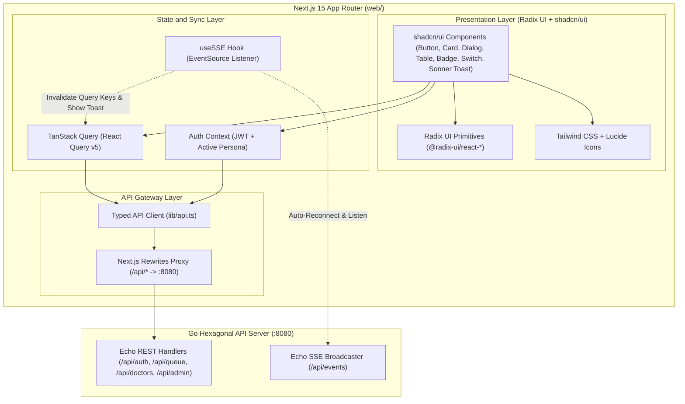

# Technical Specification: Next.js 15 Frontend SPA & Real-Time Dashboard
**File:** `docs/tech/06-frontend-nextjs-tech.md`  
**Status:** Approved  
**Version:** `v1.0.0`  
**Target Audience:** Frontend Engineers, UI/UX Designers, Full-Stack Architects  
**Scope:** Next.js 15 App Router, TypeScript, Tailwind CSS, Radix UI Primitives, shadcn/ui Component System, TanStack Query v5, Real-Time SSE Invalidation  

---

## 1. Engineering Definition & Core Objectives

The Frontend Single-Page Application (SPA) serves as the primary visual interface for all clinic stakeholders (*Patients, Doctors, Clinic Administrators, and Waiting Room Visitors*).

### 1.1 Core Frontend Principles
1. **Sub-second Real-time State Synchronization:** Immediate visual reaction to queue events (`QUEUE_UPDATED`, `TICKET_CALLED`, `DOCTOR_STATUS_CHANGED`) without full page reloads via **Server-Sent Events (SSE)**.
2. **Zero-Friction Persona Evaluation:** Dedicated sticky **One-Click Demo Switcher** enabling instant role switching (*Patient John, Patient Lucas, Dr. Sarah, Dr. Brian, Admin CEO*) with auto-populated JWT sessions.
3. **Enterprise Accessibility & Ergonomics:** Component primitives built on **Radix UI** ensuring ARIA accessibility, keyboard navigation, focus trapping, and zero layout shift.
4. **Resilient Type Safety:** Strict TypeScript models directly mirroring backend Go DTOs to guarantee compile-time safety across all API interactions.

---

## 2. Technology Stack & Architectural Layers



---

## 3. Directory Layout & Module Structure

```
web/
├── app/                                  # Next.js 15 App Router
│   ├── layout.tsx                        # Global Provider Root (QueryClient, AuthProvider, Sonner Toaster)
│   ├── page.tsx                          # Landing Portal / Quick Role Switcher
│   ├── patient/
│   │   └── page.tsx                      # Patient Portal (Queue Join & Live Countdown)
│   ├── doctor/
│   │   └── page.tsx                      # Doctor Workspace (Shift Switch, Call Next, Timer)
│   ├── admin/
│   │   ├── page.tsx                      # Executive Analytics & Doctor Productivity
│   │   └── audit/
│   │       └── page.tsx                  # Audit Trail & Activity Logging Viewer
│   └── display/
│       └── page.tsx                      # Waiting Room Public TV Display (Fullscreen)
│
├── components/
│   ├── ui/                               # shadcn/ui accessible components
│   │   ├── button.tsx
│   │   ├── card.tsx
│   │   ├── badge.tsx
│   │   ├── switch.tsx
│   │   ├── table.tsx
│   │   ├── tabs.tsx
│   │   ├── dialog.tsx
│   │   ├── select.tsx
│   │   ├── input.tsx
│   │   ├── progress.tsx
│   │   ├── separator.tsx
│   │   └── sonner.tsx                    # Sonner toast provider
│   ├── navbar.tsx                        # Global navigation bar & active role badge
│   ├── demo-switcher.tsx                 # Sticky One-Click Persona Switcher
│   └── sse-toast-listener.tsx            # Global SSE broadcast event listener & toaster
│
├── hooks/
│   ├── use-sse.ts                        # Auto-reconnecting EventSource hook
│   ├── use-auth.ts                       # Auth state & token storage hook
│   └── use-countdown.ts                  # Client-side minute countdown timer
│
├── lib/
│   ├── utils.ts                          # cn() styling helper (clsx + tailwind-merge)
│   ├── api.ts                            # Typed Axios/Fetch API client with JWT interceptor
│   └── types.ts                          # Strict TypeScript DTO interfaces
│
├── components.json                       # shadcn/ui configuration
├── tailwind.config.ts                    # Tailwind CSS configuration
├── tsconfig.json
├── package.json
└── next.config.ts                        # Next.js rewrites configuration
```

---

## 4. Real-Time Server-Sent Events (SSE) Synchronization & Adaptive Polling

### 4.1 Event Mapping & Query Key Invalidation
When an event arrives via `GET /api/events` (formatted as standard `data: {"type": "...", "data": {...}}`), the `useSSE` hook parses the payload and invalidates specific **TanStack Query keys**, triggering instant non-blocking background re-fetching:

| Event Type | Event Description | Invalidated Query Keys | Toast Notification |
| :--- | :--- | :--- | :--- |
| `QUEUE_UPDATED` / `QUEUE_JOINED` | New patient joined, called, or finished | `['queue-status']`, `['my-ticket']`, `['doctor-workspace']`, `['admin-stats']`, `['admin-audit-logs-infinite']` | None (Silent UI update) |
| `TICKET_CALLED` | Doctor called next patient into room | `['queue-status']`, `['my-ticket']`, `['doctor-workspace']`, `['admin-stats']`, `['admin-audit-logs-infinite']` | *"Ticket {number} called to {doctor}."* |
| `TICKET_FINISHED` | Consultation ended | `['queue-status']`, `['my-ticket']`, `['doctor-workspace']`, `['admin-stats']`, `['admin-audit-logs-infinite']` | *"Ticket {number} consultation completed."* |
| `DOCTOR_STATUS_CHANGED`| Doctor toggled Online/Offline | `['queue-status']`, `['my-ticket']`, `['doctor-workspace']`, `['admin-stats']`, `['admin-audit-logs-infinite']` | Notification Center badge update |
| `DOCTOR_CONFIG_UPDATED`| Admin changed doctor speed config | `['queue-status']`, `['my-ticket']`, `['admin-stats']`, `['admin-audit-logs-infinite']` | Notification Center badge update |
| `AUDIT_LOG_CREATED` | New forensic activity recorded | `['admin-audit-logs-infinite']`, `['admin-audit-logs']` | Super Admin Notification badge update |

### 4.2 Adaptive SSE Polling Architecture
To achieve optimal client performance, low network overhead, and continuous reliability:
- **SSE Connected (`isConnected === true`):** Background queries use a lazy heartbeat interval (`refetchInterval: 30000` / 30s) while state mutations are pushed instantly via NATS JetStream sub-second events.
- **SSE Disconnected / Reconnecting (`isConnected === false`):** Background queries automatically fallback to high-frequency polling (`refetchInterval: 3000` / 3s) until the real-time stream reconnects.

---

## 5. Screen Specifications & User Experience

### 5.1 Global Demo Switcher (`demo-switcher.tsx` & `header.tsx`)
A universal persona switcher accessible across all pages:
- **Available Personas:**
  - **Admin CEO** (`admin` / `password123` - UUID: `01919df4-8e3b-7412-a1f9-90b567c9e205`)
  - **Dr. Sarah Adams** (`doctor_a` / `password123` - Doctor ID: `01919df4-8e3b-7412-a1f9-90b567c9e101`, 3m avg)
  - **Dr. Brian Miller** (`doctor_b` / `password123` - Doctor ID: `01919df4-8e3b-7412-a1f9-90b567c9e102`, 4m avg)
  - **Patient John Doe** (`patient_john` / `password123` - UUID: `01919df4-8e3b-7412-a1f9-90b567c9e203`)
  - **Patient Lucas Smith** (`patient_lucas` / `password123` - UUID: `01919df4-8e3b-7412-a1f9-90b567c9e204`)
- **Behavior:** Clicking a persona immediately logs in, stores the JWT, switches the persona badge, and navigates to the persona's designated portal.

---

### 5.2 Patient Portal (`/patient`)
- **Queue Join Form:** Input for patient name + Segmented selector (Myself vs Someone Else) + One-click "Take Queue Ticket" button.
- **Active Ticket Card:**
  - Ticket Number badge (e.g., `A-01`).
  - Animated Estimated Wait Time countdown in minutes.
  - Number of patients ahead in line (`position - 1`).
  - Dynamic status indicator (`WAITING` in Amber, `IN_CONSULTATION` in Emerald with room assignment).
- **Offline / Edge Case Notices:** Informational banner displayed when all doctors are offline or clinic queue is paused.

---

### 5.3 Doctor Workspace (`/doctor`)
- **Shift Status Control:** Large tactile Radix Switch toggling `is_online` (Green = Online, Gray = Offline).
- **Active Consultation Room:**
  - When room is empty: Big "Call Next Patient" button (calls atomic backend endpoint).
  - When patient is in room: Patient Name, Queue Number, Consultation Elapsed Timer (`02:45`), Target Pacing Progress Bar, and "Complete Consultation" button.
- **Live Waiting Queue Preview:** Table listing currently waiting patients in the lobby.

---

### 5.4 Executive Admin Dashboard & Audit Trail (`/admin` & `/admin/audit`)
- **Clinic KPI Scorecards:**
  - Total Patients Served Today
  - Average Wait Time (Minutes)
  - Active Online Doctors
  - Overall Clinic Utilization Rate (%)
- **Doctor Productivity Table:**
  - Doctor Name, Status (Online/Offline), Consultations Completed Today, Actual Avg Consultation Time, Target Consultation Time (Editable dialog modal with live validation).
- **Activity Logging & Audit Trail (`/admin/audit`):**
  - Searchable audit stream with action taxonomy filters (`QUEUE_JOINED`, `TICKET_CALLED`, `CONSULTATION_FINISHED`, `DOCTOR_CONFIG_UPDATED`) and role filters (`patient`, `doctor`, `admin`).
  - Infinite scroll / Cursor Pagination with date range selection and sorting direction.

---

### 5.5 Public Waiting Room TV Screen (`/display`)
- High-contrast, full-screen television display layout.
- Left column: Large **Currently Serving** ticket numbers with assigned doctor room names.
- Right column: Next upcoming waiting tickets and live clinic status with deterministic greedy wait time estimations.

---

## 6. TypeScript DTO Interface Definitions (`lib/types.ts`)

```typescript
export type Role = 'patient' | 'doctor' | 'admin';

export interface User {
  id: string;
  username: string;
  name: string;
  role: Role;
  doctor_id?: string | null;
}

export interface AuthResponse {
  token: string;
  user: User;
}

export interface QueueTicket {
  id: string;
  user_id?: string | null;
  patient_name: string;
  queue_number: string;
  status: 'WAITING' | 'IN_CONSULTATION' | 'COMPLETED' | 'CANCELLED';
  position_in_queue?: number;
  ahead_count?: number;
  position?: number;
  estimated_wait_time_minutes?: number | null;
  notice?: string;
  created_at: string;
}

export interface DoctorAvailability {
  id: string;
  name: string;
  avg_time: number;
  is_online: boolean;
  status: 'AVAILABLE' | 'IN_CONSULTATION' | 'OFFLINE';
  current_patient?: string;
  elapsed_minutes?: number;
}

export interface QueueTicketSummary {
  queue_number: string;
  patient_name: string;
  estimated_wait_minutes?: number | null;
  notice?: string;
}

export interface QueueStatusResponse {
  online_doctors: DoctorAvailability[];
  total_waiting: number;
  queue_list: QueueTicketSummary[];
  notice?: string;
  online_doctors_count?: number;
  waiting_tickets?: QueueTicket[];
  estimated_wait_time_minutes?: number;
}

export interface ConsultationSession {
  id: string;
  doctor_id: string;
  ticket_id: string;
  patient_name: string;
  started_at: string;
  ended_at?: string | null;
  actual_duration_seconds?: number | null;
  is_active: boolean;
  ticket?: QueueTicket;
}

export interface DoctorWorkspace {
  doctor_id: string;
  doctor_name: string;
  avg_consultation_time?: number;
  is_online: boolean;
  status: 'OFFLINE' | 'AVAILABLE' | 'IN_CONSULTATION';
  active_session?: ConsultationSession | null;
}

export interface DoctorPerformance {
  doctor_id: string;
  doctor_name: string;
  username?: string;
  target_avg_minutes: number;
  is_online: boolean;
  total_consultations_today: number;
  avg_actual_consultation_minutes: number;
  utilization_rate_percentage: number;
}

export interface AdminDashboardStats {
  summary: {
    total_served_today: number;
    avg_waiting_time_minutes: number;
    online_doctors_count: number;
    clinic_utilization_rate_percentage: number;
  };
  doctor_performance: DoctorPerformance[];
}

export interface AuditLog {
  id: string;
  action: string;
  user_id?: string | null;
  actor_name: string;
  role: string;
  ip_address: string;
  details?: Record<string, any>;
  metadata?: Record<string, any>;
  created_at: string;
}

export interface PaginatedAuditLogs {
  page?: number;
  limit: number;
  next_cursor?: string | null;
  has_more?: boolean;
  total_records: number;
  total_pages: number;
  logs: AuditLog[];
}

export interface SSEEventPayload {
  type: "QUEUE_UPDATED" | "TICKET_CALLED" | "TICKET_FINISHED" | "DOCTOR_STATUS_CHANGED" | "DOCTOR_CONFIG_UPDATED" | "AUDIT_LOG_CREATED";
  timestamp: string;
  data: Record<string, any>;
}
```

---

## 7. Document Revision History

| Version | Date | Author / Role | Change Type | Change Summary / Rationale |
| :---: | :---: | :---: | :---: | :--- |
| **v1.0.0** | 2026-08-29 | Principal Frontend Architect | **Initial Baseline** | Master technical specification for Next.js 15 App Router, TypeScript, Radix UI, shadcn/ui, TanStack Query, and real-time SSE synchronization. |
| **v1.1.0** | 2026-08-30 | Principal Frontend Architect | **Native UUIDv7 & Adaptive SSE** | Updated all TypeScript DTO models to Native UUIDv7 string IDs. Documented standard SSE payload parsing and adaptive SSE polling architecture (`isConnected ? 30000 : 3000`). |
| **v1.2.0** | 2026-08-30 | Principal Frontend Architect | **Canonical Event Envelope Standardization** | Standardized SSE and NATS event schema to canonical single `type` field with role-based Notification Center filtering. |
| **v1.3.0** | 2026-08-30 | Principal Frontend Architect | **Human Tier 1 Handle Integration** | Added `username` to `DoctorPerformance` DTO to support `@username` handle presentation in executive doctor productivity table. |
