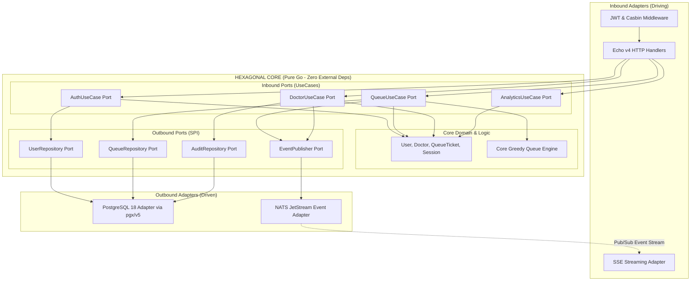
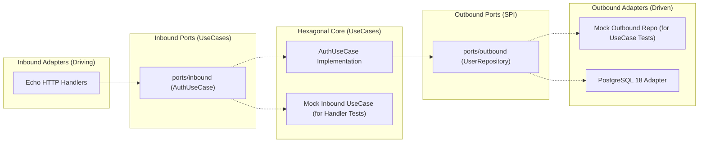

# Technical Architecture Specification: Master Overview
**File:** `docs/tech/ARCH.md`  
**Status:** Approved  
**Version:** `v1.0.0`

---

## 1. System Architecture: Hexagonal Architecture (Ports & Adapters)

The backend strictly follows **Hexagonal Architecture (Ports & Adapters)** to isolate pure business logic from external frameworks, databases, and messaging systems.

### 1.1 Hexagonal Architecture Diagram



---

## 2. Directory Structure & Hexagonal Layering

```
code/web-app/
├── cmd/
│   └── api/
│       └── main.go                      # Composition Root (Dependency Injection & Server Bootstrap)
│
├── internal/
│   ├── core/                            # CENTER: Hexagonal Core (Zero external framework dependencies)
│   │   ├── domain/                      # Entities & Pure Business Rules
│   │   │   ├── user.go
│   │   │   ├── doctor.go
│   │   │   ├── queue.go
│   │   │   ├── session.go
│   │   │   ├── audit.go
│   │   │   └── calculator.go            # Pure Deterministic Greedy Queue Engine
│   │   │
│   │   ├── ports/                       # Interfaces (Decoupled Inbound & Outbound)
│   │   │   ├── inbound/                 # Driving Ports (What outsiders can request from the Core)
│   │   │   │   ├── auth_port.go         # AuthUseCase interface
│   │   │   │   ├── queue_port.go        # QueueUseCase interface
│   │   │   │   ├── doctor_port.go       # DoctorUseCase interface
│   │   │   │   └── analytics_port.go    # AnalyticsUseCase interface
│   │   │   │
│   │   │   └── outbound/                # Driven Ports / SPI (What Core needs from Infrastructure)
│   │   │       ├── user_repo_port.go    # UserRepository interface
│   │   │       ├── queue_repo_port.go   # QueueRepository interface
│   │   │       ├── doctor_repo_port.go  # DoctorRepository interface
│   │   │       ├── event_pub_port.go    # EventPublisher interface
│   │   │       └── audit_repo_port.go   # AuditRepository interface
│   │   │
│   │   └── usecase/                     # Application Business Logic (Implements Inbound Ports)
│   │       ├── auth_usecase.go
│   │       ├── auth_usecase_test.go     # 100% Table-driven tests
│   │       ├── queue_usecase.go
│   │       ├── doctor_usecase.go
│   │       └── analytics_usecase.go
│   │
│   └── adapters/                        # OUTSIDE: Concrete Adapters (Mirrors Ports)
│       ├── inbound/                     # Driving Adapters (Implements/Calls Inbound Ports)
│       │   ├── http/
│       │   │   ├── auth_handler.go
│       │   │   ├── auth_handler_test.go # 100% Table-driven tests
│       │   │   ├── queue_handler.go
│       │   │   ├── doctor_handler.go
│       │   │   ├── admin_handler.go
│       │   │   └── sse_handler.go
│       │   └── middleware/
│       │       ├── jwt_auth.go
│       │       └── casbin_rbac.go
│       │
│       └── outbound/                    # Driven Adapters (Implements Outbound Ports)
│           ├── postgres/                # PostgreSQL 18 repository implementation (pgx/v5)
│           │   ├── db.go
│           │   ├── migration.go
│           │   ├── user_repo.go
│           │   ├── queue_repo.go
│           │   ├── doctor_repo.go
│           │   └── audit_repo.go
│           └── nats/                    # NATS JetStream event publisher & consumer
│               ├── nats_client.go
│               └── nats_event_publisher.go
│
├── config/                              # Casbin Model, Policy & Env Config
├── migrations/                          # Goose SQL Migrations
├── web/                                 # Vue 3 Frontend SPA (Vite + Tailwind CSS)
├── Dockerfile
└── docker-compose.yml                   # App + PostgreSQL 18 + NATS JetStream
```

---

## 3. Database Migration Strategy with Goose

Migrations are managed with **Goose v3** and embedded into the binary using `//go:embed`:

```go
//go:embed migrations/*.sql
var embedMigrations embed.FS

func RunDatabaseMigrations(db *sql.DB) error {
    goose.SetBaseFS(embedMigrations)
    if err := goose.SetDialect("postgres"); err != nil {
        return err
    }
    return goose.Up(db, "migrations")
}
```

This guarantees zero manual database setup during Docker startup or CEO demonstrations.

---

## 4. Testing Architecture & Quality Assurance Standards (Hexagonal Ports & Adapters)

To guarantee enterprise reliability and regression prevention, the codebase enforces an **Interface-Driven Ports & Adapters Decoupling Strategy** targeting **100% Test Coverage** on **UseCases (Hexagonal Core)** and **Inbound Handlers (Driving Adapters)** using the **Table-Driven Test Pattern**.

### 4.1 Mocking Strategy & Dependency Inversion in Hexagonal Architecture



### 4.2 Standard Table-Driven Test Structure in Go 1.27

```go
func TestAuthUseCase_Login(t *testing.T) {
    tests := []struct {
        name        string
        username    string
        password    string
        mockSetup   func(repo *mockUserRepoPort)
        wantToken   bool
        wantErr     error
    }{
        // Positive, negative, validation, and edge cases
    }

    for _, tt := range tests {
        t.Run(tt.name, func(t *testing.T) {
            // Execute UseCase and assert with zero DB dependency
        })
    }
}
```

---

## 5. Document Revision History & Requirement Changelog

| Version | Date | Author / Role | Change Type | Change Summary / Rationale |
| :---: | :---: | :---: | :---: | :--- |
| **v1.0.0** | 2026-08-29 | Principal Architect | **Initial Baseline** | Master technical architecture specification. |
| **v1.1.0** | 2026-08-29 | Principal Architect | **Testing Spec** | Added Section 4: Testing Architecture, Interface Decoupling, and 100% Table-Driven Coverage Standards. |
| **v1.2.0** | 2026-08-29 | Principal Architect | **Hexagonal Refactor** | Refactored Section 4 to strictly align with Hexagonal Architecture Ports & Adapters mocking and test structure. |
| **v1.3.0** | 2026-08-29 | Principal Architect | **Infra & E2E Validation** | Updated PostgreSQL 18 volume mount path (`/var/lib/postgresql`) and host port mapping (`5433:5432`) to prevent environment port collisions during integration testing. |
