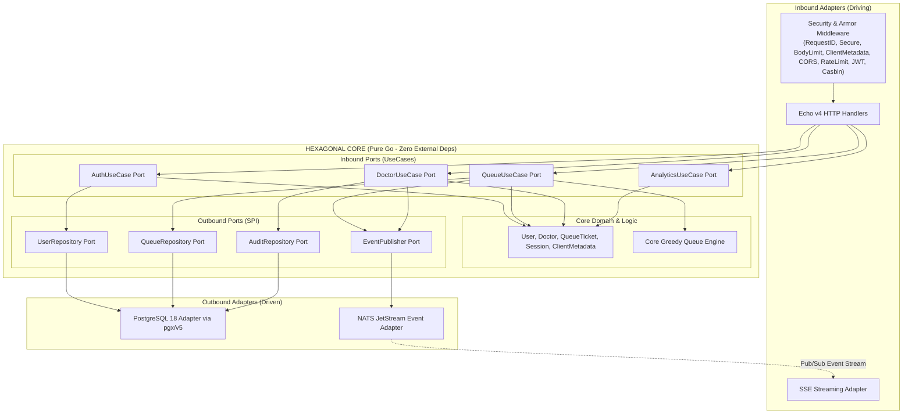
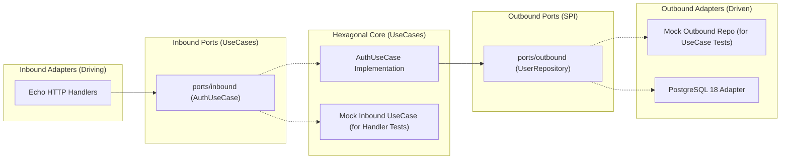
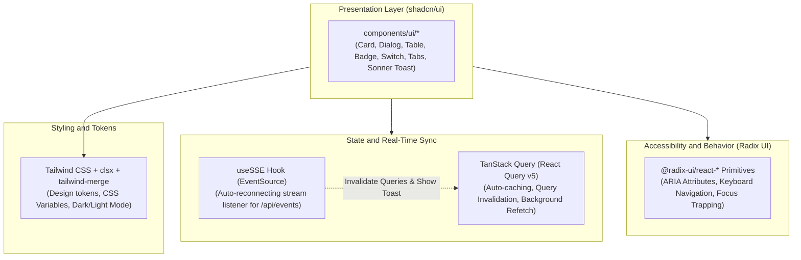

# Technical Architecture Specification: Master Overview
**File:** `docs/tech/ARCH.md`  
**Status:** Approved  
**Version:** `v1.5.0`

---

## 1. System Architecture: Hexagonal Architecture (Ports & Adapters)

The backend strictly follows **Hexagonal Architecture (Ports & Adapters)** to isolate pure business logic from external frameworks, databases, and messaging systems.

### 1.1 Hexagonal Architecture Diagram



### 1.2 Inbound Middleware Pipeline & Forensic Context Flow

Every inbound HTTP request traverses a hardened middleware armor chain before reaching domain handlers:

```mermaid
flowchart LR
    Req[Incoming HTTP Request] --> M1[1. RequestID\nX-Request-ID]
    M1 --> M2[2. Logger & Recover]
    M2 --> M3[3. Secure Armor\nX-Frame, X-XSS, CSP]
    M3 --> M4[4. BodyLimit\nMax 1MB]
    M4 --> M5[5. ClientMetadata\nIP, UA, ReqID -> Context]
    M5 --> M6[6. CORS Config\nOrigin Whitelisting]
    M6 --> M7[7. RateLimiter\nToken Bucket 10-30 req/min]
    M7 --> M8[8. JWT Auth\nBearer Token]
    M8 --> M9[9. Casbin RBAC\nRole Matrix Enforce]
    M9 --> Handler[Domain HTTP Handler]
```



Forensic client metadata (`ClientIP`, `UserAgent`, `RequestID`) is extracted early in the pipeline, attached to the standard Go `context.Context`, and seamlessly propagated across Hexagonal Core boundaries to NATS Event Envelopes and the asynchronous `AuditWorker`.

---

## 2. Directory Structure & Hexagonal Layering

```
code/web-app/
├── cmd/
│   └── api/
│       └── main.go                      # Composition Root (Dependency Injection & Server Bootstrap)
│
├── internal/
│   ├── core/                            # CENTER: Hexagonal Core (Zero external framework dependencies)
│   │   ├── domain/                      # Entities & Pure Business Rules
│   │   │   ├── user.go
│   │   │   ├── doctor.go
│   │   │   ├── queue.go
│   │   │   ├── session.go
│   │   │   ├── audit.go
│   │   │   ├── metadata.go              # Client Forensic Metadata & Context Helpers
│   │   │   └── calculator.go            # Pure Deterministic Greedy Queue Engine
│   │   │
│   │   ├── ports/                       # Interfaces (Decoupled Inbound & Outbound)
│   │   │   ├── inbound/                 # Driving Ports (What outsiders can request from the Core)
│   │   │   │   ├── auth_port.go         # AuthUseCase interface
│   │   │   │   ├── queue_port.go        # QueueUseCase interface
│   │   │   │   ├── doctor_port.go       # DoctorUseCase interface
│   │   │   │   └── analytics_port.go    # AnalyticsUseCase interface
│   │   │   │
│   │   │   └── outbound/                # Driven Ports / SPI (What Core needs from Infrastructure)
│   │   │       ├── user_repo_port.go    # UserRepository interface
│   │   │       ├── queue_repo_port.go   # QueueRepository interface
│   │   │       ├── doctor_repo_port.go  # DoctorRepository interface
│   │   │       ├── event_pub_port.go    # EventPublisher interface
│   │   │       └── audit_repo_port.go   # AuditRepository interface
│   │   │
│   │   └── usecase/                     # Application Business Logic (Implements Inbound Ports)
│   │       ├── auth_usecase.go
│   │       ├── auth_usecase_test.go     # 100% Table-driven tests
│   │       ├── queue_usecase.go
│   │       ├── doctor_usecase.go
│   │       └── analytics_usecase.go
│   │
│   └── adapters/                        # OUTSIDE: Concrete Adapters (Mirrors Ports)
│       ├── inbound/                     # Driving Adapters (Implements/Calls Inbound Ports)
│       │   ├── http/
│       │   │   ├── auth_handler.go
│       │   │   ├── auth_handler_test.go # 100% Table-driven tests
│       │   │   ├── queue_handler.go
│       │   │   ├── doctor_handler.go
│       │   │   ├── admin_handler.go
│       │   │   └── sse_handler.go
│       │   ├── middleware/
│       │   │   ├── jwt_auth.go
│       │   │   ├── casbin_rbac.go
│       │   │   ├── metadata.go          # Forensic Metadata Context Injector
│       │   │   └── rate_limiter.go      # Token Bucket Rate Limiters (Auth & Queue)
│       │   └── worker/
│       │       └── audit_worker.go      # NATS JetStream Consumer -> audit_logs
│       │
│       └── outbound/                    # Driven Adapters (Implements Outbound Ports)
│           ├── postgres/                # PostgreSQL 18 repository implementation (pgx/v5)
│           │   ├── db.go
│           │   ├── migration.go
│           │   ├── user_repo.go
│           │   ├── queue_repo.go
│           │   ├── doctor_repo.go
│           │   └── audit_repo.go
│           └── nats/                    # NATS JetStream event publisher & consumer
│               ├── nats_client.go
│               └── nats_publisher.go
│
├── config/                              # Casbin Model, Policy & Env Config
├── migrations/                          # Goose SQL Migrations
├── web/                                 # Next.js 15 Frontend SPA (React 19 + TypeScript + Tailwind CSS + Radix UI + shadcn/ui)
├── Dockerfile
└── docker-compose.yml                   # App + PostgreSQL 18 + NATS JetStream
```

---

## 3. Database Migration Strategy with Goose

Migrations are managed with **Goose v3** and embedded into the binary using Go standard library `embed.FS`:

```go
// migrations/embed.go
package migrations

import "embed"

//go:embed *.sql
var FS embed.FS
```

```go
// internal/adapters/outbound/postgres/migration.go
package postgres

func RunDatabaseMigrations(pool *pgxpool.Pool) error {
    db := stdlib.OpenDBFromPool(pool)
    defer db.Close()

    goose.SetBaseFS(migrations.FS)
    if err := goose.SetDialect("postgres"); err != nil {
        return fmt.Errorf("set goose dialect: %w", err)
    }
    return goose.Up(db, ".")
}
```

This guarantees zero manual database setup during Docker startup or CEO demonstrations.

---

## 4. Testing Architecture & Quality Assurance Standards (Hexagonal Ports & Adapters)

To guarantee enterprise reliability and regression prevention, the codebase enforces an **Interface-Driven Ports & Adapters Decoupling Strategy** targeting **100% Test Coverage** on **UseCases (Hexagonal Core)** and **Inbound Handlers (Driving Adapters)** using the **Table-Driven Test Pattern**.

### 4.1 Mocking Strategy & Dependency Inversion in Hexagonal Architecture



### 4.2 Standard Table-Driven Test Structure in Go 1.27

```go
func TestAuthUseCase_Login(t *testing.T) {
    tests := []struct {
        name        string
        username    string
        password    string
        mockSetup   func(repo *mockUserRepoPort)
        wantToken   bool
        wantErr     error
    }{
        // Positive, negative, validation, and edge cases
    }

    for _, tt := range tests {
        t.Run(tt.name, func(t *testing.T) {
            // Execute UseCase and assert with zero DB dependency
        })
    }
}
```

---

## 5. Frontend Architecture (Next.js 15 + TypeScript + Radix UI + shadcn/ui)

The client application is built as a modern Single-Page Application (SPA) using **Next.js 15 (App Router)**, **TypeScript**, **Tailwind CSS**, **Radix UI**, **shadcn/ui**, and **TanStack Query v5**.

### 5.1 Presentation & Component Layer



### 5.2 Real-Time SSE Invalidation Flow & Adaptive Polling
1. Next.js client connects to `GET /api/events` via `useSSE`.
2. When backend events (`QUEUE_UPDATED`, `DOCTOR_STATUS_CHANGED`, `TICKET_CALLED`, `TICKET_FINISHED`, `DOCTOR_CONFIG_UPDATED`, `AUDIT_LOG_CREATED`) arrive over SSE (formatted as standard `data:` envelope), the hook:
   - Dispatches visual alerts via **Sonner Toast**.
   - Invalidates corresponding TanStack Query keys (`['queue-status']`, `['my-ticket']`, `['doctor-workspace']`, `['admin-stats']`, `['admin-audit-logs-infinite']`), triggering instant seamless re-renders across all active client views.
3. **Adaptive Polling Guard:** When SSE stream is active (`isConnected === true`), background polling switches to a lazy 30s interval, reducing network requests and database read load by 90%. If SSE drops, it automatically ramps up to 3s fallback polling until reconnected.

---

## 6. Enterprise Identity Architecture & UUIDv7 Standard

All entity primary keys, relational foreign keys, and security boundaries across the platform utilize **Native UUIDv7 (Time-Ordered Monotonic 128-bit UUIDs)** with a **3-Tier Identity Resolution Model**:
1. **Tier 1 (Human-Facing Display):** Concise, memorable codes (`A-01`, `@doctor_a`, `Dr. Sarah Adams`) for patients, doctors, and PA audio.
2. **Tier 2 (API & Security Boundary):** Unguessable 36-character UUIDv7 strings in REST JSON DTOs and JWT claims (Anti-IDOR).
3. **Tier 3 (PostgreSQL 18 Storage Engine):** High-throughput, right-edge sequential B-Tree indexing via native `DEFAULT uuidv7()`.

> [!NOTE]
> For the comprehensive technical specification, RFC 9562 byte layout, PostgreSQL 18 functions, Go 1.27 standard library integration, and system-wide mapping matrix, refer to:  
> **[`docs/tech/IDENTITY-DESIGN.md`](file:///mnt/Cons/Code/Project/Jobs/Noak/code/web-app/docs/tech/IDENTITY-DESIGN.md)**

---

## 7. Security Armor & Token Bucket Rate Limiting Architecture

The platform enforces defense-in-depth protection via an Inbound Middleware Armor chain (RequestID, Secure Headers, BodyLimit, Whitelisted CORS, and Token Bucket Rate Limiting):
1. **Token Bucket Rate Limiting:** Enforces strict burst-tolerant limits ($10\text{ req/min}$, burst $5$ on Auth; $30\text{ req/min}$, burst $10$ on Queue Join) via `golang.org/x/time/rate`.
2. **Forensic Context Propagation:** Automatically captures `ClientIP`, `UserAgent`, and `RequestID` in request context and forwards them asynchronously through NATS JetStream into PostgreSQL `audit_logs`.
3. **Payload & Frame Armor:** Constrains request body payloads to $1\text{MB}$ and enforces strict CSP, Frame, and MIME security headers.

> [!NOTE]
> For the comprehensive technical specification, mathematical formulations, algorithm comparisons, and sequence diagrams, refer to:  
> **[`docs/tech/RATE-LIMITING-AND-ARMOR-TECH.md`](file:///mnt/Cons/Code/Project/Jobs/Noak/code/web-app/docs/tech/RATE-LIMITING-AND-ARMOR-TECH.md)**

---

## 8. Document Revision History & Requirement Changelog

| Version | Date | Author / Role | Change Type | Change Summary / Rationale |
| :---: | :---: | :---: | :---: | :--- |
| **v1.0.0** | 2026-08-29 | Principal Architect | **Initial Baseline** | Master technical architecture specification. |
| **v1.1.0** | 2026-08-29 | Principal Architect | **Testing Spec** | Added Section 4: Testing Architecture, Interface Decoupling, and 100% Table-Driven Coverage Standards. |
| **v1.2.0** | 2026-08-29 | Principal Architect | **Hexagonal Refactor** | Refactored Section 4 to strictly align with Hexagonal Architecture Ports & Adapters mocking and test structure. |
| **v1.3.0** | 2026-08-29 | Principal Architect | **Infra & E2E Validation** | Updated PostgreSQL 18 volume mount path (`/var/lib/postgresql`) and host port mapping (`5433:5432`) to prevent environment port collisions during integration testing. |
| **v1.4.0** | 2026-08-29 | Principal Architect | **Frontend Stack Update** | Updated frontend specification to Next.js 15 (App Router) + TypeScript + Tailwind CSS + Radix UI + shadcn/ui + TanStack Query v5 with real-time SSE cache invalidation. |
| **v1.5.0** | 2026-08-30 | Principal Architect | **Native UUIDv7 & Identity Spec** | Migrated entity identification to Native UUIDv7 (PostgreSQL 18 `uuidv7()` + Go 1.27 `uuid` pkg) and added Section 6.2 Dual-Layer Identity Architecture separating DB keys from human display codes. |
| **v1.6.0** | 2026-08-30 | Principal Architect | **Adaptive SSE Synchronization** | Documented standard SSE payload envelope and adaptive polling architecture reducing redundant queries by 90% while maintaining sub-second UI synchronization. |
| **v1.7.0** | 2026-08-30 | Principal Architect | **Canonical Event Envelope Standardization** | Standardized platform event envelope to canonical single `type` field across Go Hexagonal adapters, NATS JetStream, and Next.js SSE client. |
| **v1.8.0** | 2026-08-31 | Backend Security Engineer | **Security Armor & Rate Limiting Spec** | Added Section 7 and updated Sections 1.1/1.2 for Security Armor Middlewares, Token Bucket Rate Limiting, and Forensic Context Flow. |
