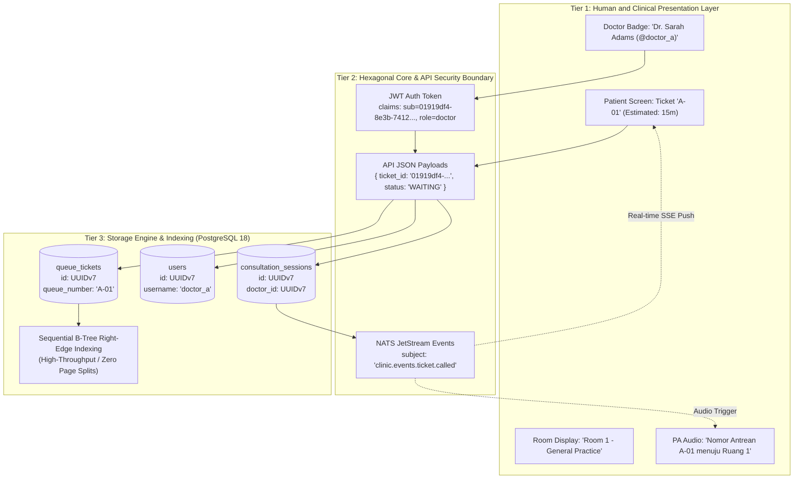

# Technical Specification: Enterprise Identity Architecture & UUIDv7 Standard
**File:** `docs/tech/IDENTITY-DESIGN.md`  
**Status:** Approved  
**Version:** `v1.0.0`  

---

## 1. Executive Summary & Architectural Motivation

In modern healthcare and clinical operations platforms, entity identification must simultaneously satisfy two contrasting requirements:
1. **Cryptographic Security & System Integrity:** Unguessable, distributed, non-colliding, and high-performance database primary keys that prevent horizontal privilege escalation (Insecure Direct Object Reference / IDOR) and eliminate B-Tree index fragmentation.
2. **Clinical Ergonomics & Human UX:** Concise, human-friendly display codes and memorable handles (`A-01`, `@doctor_a`, `Dr. Sarah Adams`) that patients, doctors, and audio announcement systems can easily read, pronounce, and track.

To achieve this, Smart Clinic OS implements a **3-Tier Identity Architecture** built on **Native UUIDv7 (RFC 9562)** in **PostgreSQL 18** and the **Go 1.27 Standard Library `uuid` Package**.

---

## 2. 3-Tier Identity Resolution Architecture



### 2.1 The Three Tiers Defined
1. **Tier 1: Human-Facing Display Identifiers:**
   - **Audience:** Walk-in patients, consulting doctors, receptionists, display TVs, PA systems.
   - **Format:** `queue_number` (`A-01`), `username` (`@doctor_b`), `name` (`Dr. Michael Chen`), `room_name` (`Room 1`).
   - **Characteristics:** Short, memorable, human-pronounceable, contextual to daily clinic operations.
2. **Tier 2: API & Security Boundary Identifiers:**
   - **Audience:** Next.js frontend client, REST API endpoints, JWT tokens, NATS JetStream event payloads.
   - **Format:** Canonical 36-character UUIDv7 string (e.g. `01919df4-8e3b-7412-a1f9-90b567c9e101`).
   - **Characteristics:** Statistically unguessable, tamper-proof, uniform formatting across all REST and SSE interfaces.
3. **Tier 3: Database & Storage Engine Keys:**
   - **Audience:** PostgreSQL 18 storage engine, foreign key constraints, B-Tree indexes.
   - **Format:** Native 128-bit binary `UUID` type generated via PostgreSQL 18's built-in `DEFAULT uuidv7()`.
   - **Characteristics:** Monotonically increasing, time-ordered, clusterable, zero random disk page splits.

---

## 3. RFC 9562 UUIDv7 Deep Dive

UUIDv7 is defined by IETF RFC 9562 as a **time-ordered UUID format**. Its 128-bit structure is organized as follows:

```
 0                   1                   2                   3
 0 1 2 3 4 5 6 7 8 9 0 1 2 3 4 5 6 7 8 9 0 1 2 3 4 5 6 7 8 9 0 1
+-+-+-+-+-+-+-+-+-+-+-+-+-+-+-+-+-+-+-+-+-+-+-+-+-+-+-+-+-+-+-+-+
|                           unix_ts_ms                          |
+-+-+-+-+-+-+-+-+-+-+-+-+-+-+-+-+-+-+-+-+-+-+-+-+-+-+-+-+-+-+-+-+
|          unix_ts_ms           |  ver  |       rand_a          |
+-+-+-+-+-+-+-+-+-+-+-+-+-+-+-+-+-+-+-+-+-+-+-+-+-+-+-+-+-+-+-+-+
|var|                        rand_b                             |
+-+-+-+-+-+-+-+-+-+-+-+-+-+-+-+-+-+-+-+-+-+-+-+-+-+-+-+-+-+-+-+-+
|                            rand_b                             |
+-+-+-+-+-+-+-+-+-+-+-+-+-+-+-+-+-+-+-+-+-+-+-+-+-+-+-+-+-+-+-+-+
```

### 3.1 Bit Layout Breakdown
- **`unix_ts_ms` (48 bits):** Unix epoch timestamp in milliseconds. Guarantees monotonic temporal ordering across the entire system.
- **`ver` (4 bits):** UUID Version identifier, strictly set to `0111` (binary 7).
- **`rand_a` (12 bits):** Sub-millisecond precision counter or pseudorandom bits to handle sub-millisecond generation without collision.
- **`var` (2 bits):** UUID Variant identifier, strictly set to `10` (RFC 4122 / RFC 9562 standard).
- **`rand_b` (62 bits):** Cryptographically secure pseudo-random entropy bits.

---

## 4. PostgreSQL 18 Native Engine Implementation

PostgreSQL 18 natively incorporates UUIDv7 support into its core engine without requiring external extensions (`uuid-ossp` or `pgcrypto`):

### 4.1 Schema Definition Pattern
```sql
CREATE TABLE users (
    id UUID PRIMARY KEY DEFAULT uuidv7(),
    username VARCHAR(50) UNIQUE NOT NULL,
    password_hash VARCHAR(255) NOT NULL,
    name VARCHAR(100) NOT NULL,
    role VARCHAR(20) NOT NULL CHECK (role IN ('patient', 'doctor', 'admin')),
    doctor_id UUID,
    created_at TIMESTAMP WITH TIME ZONE DEFAULT NOW(),
    updated_at TIMESTAMP WITH TIME ZONE DEFAULT NOW()
);
```

### 4.2 Built-in Timestamp Extraction
PostgreSQL 18 enables extracting the creation timestamp directly from any UUIDv7 value:
```sql
-- Extracts exact creation timestamp without querying created_at column
SELECT id, uuid_extract_timestamp(id) AS extracted_time FROM queue_tickets;
```

### 4.3 B-Tree Indexing Performance Advantage
Unlike UUIDv4 (which generates random values that cause frequent B-Tree page splits and disk I/O amplification), UUIDv7 values are inserted strictly at the right-edge of B-Tree index pages. This yields insertion throughput and index cache locality identical to `BIGSERIAL` while retaining global uniqueness and cryptographic randomness.

---

## 5. Go 1.27 Standard Library `uuid` Integration

Starting with **Go 1.27** (Proposal #62026), UUID generation and parsing are natively integrated into the Go standard library (`import "uuid"`):

```go
package domain

import (
    "uuid"
)

// Generate a new time-ordered UUIDv7 in Go 1.27
func NewEntityID() string {
    u := uuid.NewV7()
    return u.String()
}

// Parse and validate incoming UUID strings
func ParseEntityID(s string) (uuid.UUID, error) {
    return uuid.Parse(s)
}
```

---

## 6. Entity & Data Model Identity Mapping Matrix

| Table / Entity | Database Primary Key (`id`) | Foreign Keys | Human Display Reference | UI Presentation Context |
| :--- | :--- | :--- | :--- | :--- |
| **`users`** | `UUIDv7` (`DEFAULT uuidv7()`) | `doctor_id -> doctors.id` | `username` (`@doctor_a`) | Login form, avatar badge, auth profile. |
| **`doctors`** | `UUIDv7` (`DEFAULT uuidv7()`) | None | `name` (`Dr. Sarah Adams`) | Workspace header, room plate, leaderboard. |
| **`queue_tickets`** | `UUIDv7` (`DEFAULT uuidv7()`) | `user_id -> users.id` | `queue_number` (`A-01`) | TV board, audio announcement, ticket slip. |
| **`consultation_sessions`** | `UUIDv7` (`DEFAULT uuidv7()`) | `doctor_id`, `ticket_id` | `session_id` | Doctor active consultation timer box. |
| **`audit_logs`** | `UUIDv7` (`DEFAULT uuidv7()`) | `user_id -> users.id` | `actor_name` & `role` | Audit activity table, forensic JSON modal. |

---

## 7. Security, Privacy & IDOR Prevention

1. **Anti-Enumeration Protection:**
   Traditional integer IDs (`/api/tickets/1`, `/api/tickets/2`) expose clinics to enumeration scraping. UUIDv7 prevents attackers from guessing adjacent ticket or user IDs.
2. **Horizontal Privilege Escalation (IDOR) Mitigation:**
   Combined with Casbin RBAC, UUIDv7 prevents unauthorized cross-tenant data access even if a malicious user attempts brute-force ID guessing.
3. **Audit Immutability & Forensic Tracing:**
   Every event captured by NATS JetStream and persisted to PostgreSQL `audit_logs` records the actor's UUIDv7 along with their human display name, enabling forensic cross-system traceability.

---

## 8. Document Revision History & Requirement Changelog

| Version | Date | Author / Role | Change Type | Change Summary / Rationale |
| :---: | :---: | :---: | :---: | :--- |
| **v1.0.0** | 2026-08-30 | Principal Architect | **Initial Baseline** | Initial creation of dedicated Enterprise Identity Architecture specification detailing the 3-Tier Identity Model, RFC 9562 UUIDv7 layout, PostgreSQL 18 native functions, Go 1.27 standard library integration, and system-wide mapping matrix. |
