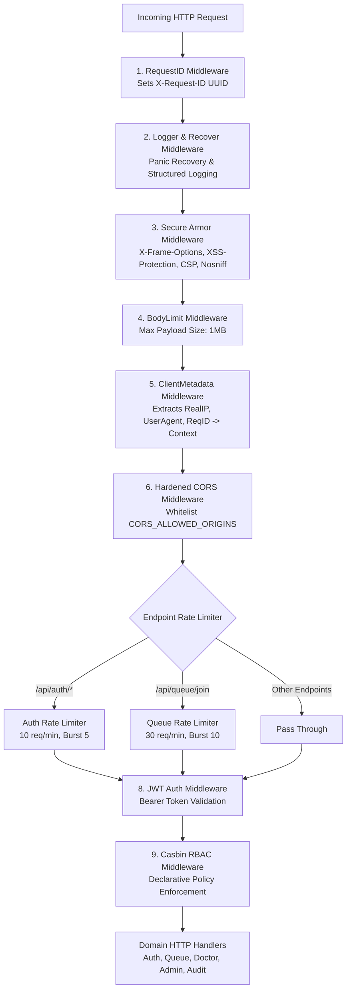
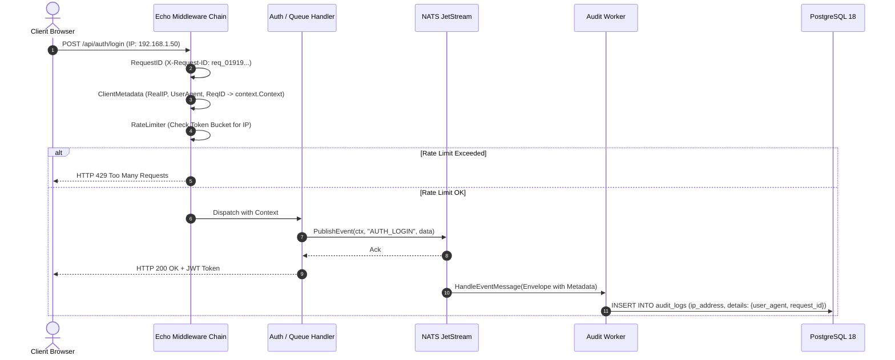

# Technical Specification: Token Bucket Rate Limiting & Security Armor
**File:** `docs/tech/RATE-LIMITING-AND-ARMOR-TECH.md`  
**Status:** Approved  
**Version:** `v1.0.0`  
**Target Environment:** Go 1.27 | Echo v4 | `golang.org/x/time/rate` | Next.js 15

---

## 1. Engineering Overview & Objectives

The Rate Limiting and Security Armor subsystem provides **defense-in-depth protection** for the Smart Clinic API. It safeguards authentication endpoints against brute-force attacks and credential stuffing, protects the queue admission pipeline from automated ticket spamming (DoS), prevents memory exhaustion via payload constraints, and captures forensic provenance across all operations.

### Core Objectives:
1. **Brute-Force & Credential Stuffing Prevention:** Throttle rapid login and registration attempts per client IP.
2. **Denial-of-Service (DoS) Queue Mitigation:** Prevent automated bots from exhausting queue numbers or flooding waiting rooms.
3. **Controlled Burst Tolerance:** Allow legitimate users to execute natural initial bursts without artificial queuing delay.
4. **Resource Governance & Memory Safety:** Enforce $O(1)$ memory consumption per client with automatic idle bucket reclamation (Zero Memory Leak).
5. **Standardized API Error Contract:** Return structured HTTP `429 Too Many Requests` responses with correlation headers (`X-Request-ID`).

---

## 2. Rate Limiting Algorithm Selection & Analysis

The platform implements the **Token Bucket Algorithm** utilizing Go's official standard library package `golang.org/x/time/rate` integrated natively into Echo v4 middleware.

### 2.1 Comparative Algorithm Matrix

| Algorithm | Burst Handling | Memory Complexity | CPU Overhead | Fit for Interactive Ingress API |
| :--- | :--- | :--- | :--- | :--- |
| **Token Bucket (Selected)** | ✅ **Optimal (Controlled Burst Capacity $b$)** | ✅ **$O(1)$ per Client (Stores 2 values)** | ✅ **$O(1)$ on-demand math ($\Delta t$)** | ⭐ **Best Fit (Smooth UX + Strict Cap)** |
| **Fixed Window** | ❌ Poor (Allows 2x boundary burst spike) | ✅ $O(1)$ per Client | ✅ Minimal | ❌ Vulnerable at window reset |
| **Sliding Log** | ✅ Exact | ❌ $O(N)$ (Grows with request volume) | ⚠️ Requires timestamp array cleanup | ❌ Unnecessary memory bloat |
| **Sliding Counter** | ⚠️ Approximate average | ✅ $O(1)$ (2 counter integers) | ✅ Minimal | ⚠️ Good for distributed coarse limits |
| **Leaky Bucket** | ❌ No burst (Strict constant outflow) | ✅ $O(1)$ | ⚠️ Requires ticker/timer overhead | ⚠️ Better for outbound traffic shaping |

### 2.2 Mathematical Formulation (Token Bucket)

Let:
- $r$: Token refill rate in tokens per second ($r = \frac{\text{Allowed Requests}}{\text{Unit Duration}}$).
- $b$: Maximum bucket capacity (Burst capacity).
- $t$: Timestamp of the incoming request.
- $t_{\text{last}}$: Timestamp of the previous token evaluation.
- $k$: Current available token balance.

Upon receipt of a request at time $t$:
$$\Delta t = t - t_{\text{last}}$$
$$k_{\text{current}} = \min\left(b, \; k_{\text{previous}} + (\Delta t \times r)\right)$$

- **Decision Rule:**
  - If $k_{\text{current}} \ge 1$: Request is **Allowed**. Decrement $k = k_{\text{current}} - 1$, set $t_{\text{last}} = t$.
  - If $k_{\text{current}} < 1$: Request is **Rejected**. Return HTTP `429 Too Many Requests`.

---

## 3. Inbound Middleware Architecture & Pipeline Sequence

Every incoming HTTP request traverses a hardened middleware armor chain before reaching domain handlers:



---

## 4. Endpoint Rate Limit Configuration & Matrix

| Scope / Endpoint | Path | Rate Limit ($r$) | Burst ($b$) | Target Threat | Response on Limit |
| :--- | :--- | :---: | :---: | :--- | :---: |
| **Authentication** | `POST /api/auth/login`<br>`POST /api/auth/register` | $10\text{ req/min}$<br>($\approx 0.16\text{ req/s}$) | $5$ | Brute-force attacks, credential stuffing, registration bot spam | `429 Too Many Requests` |
| **Patient Queue Admission** | `POST /api/queue/join` | $30\text{ req/min}$<br>($0.5\text{ req/s}$) | $10$ | Queue flooding, ticket generation DoS, ghost registrations | `429 Too Many Requests` |
| **Global API Baseline** | All other endpoints | Unbounded / Managed | N/A | Normal operations (JWT & Casbin guarded) | Normal execution |

### 4.1 Implementation (`internal/adapters/inbound/middleware/rate_limiter.go`)

```go
func NewAuthRateLimiter() echo.MiddlewareFunc {
	return echoMW.RateLimiterWithConfig(echoMW.RateLimiterConfig{
		Skipper: echoMW.DefaultSkipper,
		Store: echoMW.NewRateLimiterMemoryStoreWithConfig(
			echoMW.RateLimiterMemoryStoreConfig{
				Rate:      rate.Limit(10.0 / 60.0), // 10 requests per minute
				Burst:     5,                       // Burst tolerance
				ExpiresIn: 3 * time.Minute,         // Automatic cleanup for inactive IPs
			},
		),
		IdentifierExtractor: func(ctx echo.Context) (string, error) {
			return ctx.RealIP(), nil
		},
		ErrorHandler: func(context echo.Context, err error) error {
			return context.JSON(http.StatusTooManyRequests, map[string]string{
				"error": "Too many requests. Please wait a few moments before trying again.",
			})
		},
		DenyHandler: func(context echo.Context, identifier string, err error) error {
			return context.JSON(http.StatusTooManyRequests, map[string]string{
				"error": "Too many requests. Please wait a few moments before trying again.",
			})
		},
	})
}
```

---

## 5. Memory Management & Zero-Leak Lifecycle

1. **In-Memory Store Allocation:**  
   Each active client IP is allocated a lightweight `*rate.Limiter` struct in an internal `sync.Map`.
2. **Garbage Collection & Eviction (`ExpiresIn: 3 * time.Minute`):**  
   Echo's `RateLimiterMemoryStore` tracks the last access timestamp for every IP key. Inactive client entries are automatically pruned from the store during periodic background cleanup sweeps, guaranteeing zero memory leaks over long server uptime.
3. **No External Infrastructure Dependency:**  
   Operates entirely in-process with sub-microsecond latency, avoiding network roundtrips to external cache layers while maintaining complete protection.

---

## 6. HTTP Error Contract & API Specification

When a client breaches their configured rate limit threshold:

- **HTTP Status Code:** `429 Too Many Requests`
- **Response Headers:**
  - `Content-Type: application/json; charset=UTF-8`
  - `X-Request-ID: <uuidv7-or-uuidv4>`
- **Response Payload:**
```json
{
  "error": "Too many requests. Please wait a few moments before trying again."
}
```

---

## 7. Frontend Integration & Client Resilience (Next.js 15)

### 7.1 API Client Interceptor (`web/lib/api.ts`)
The client-side `APIClient` intercepts HTTP 429 status codes globally:
```typescript
if (response.status === 429) {
  if (typeof window !== "undefined") {
    window.dispatchEvent(new CustomEvent("clinic:rate-limited"));
  }
  let rateLimitMsg = "Too many requests (Rate limit exceeded). Please wait a few moments before trying again.";
  try {
    const errorData = await response.json();
    if (errorData.error) rateLimitMsg = errorData.error;
    else if (errorData.message) rateLimitMsg = errorData.message;
  } catch {
    // Fallback to default message
  }
  throw new Error(rateLimitMsg);
}
```

### 7.2 UI Debounce & Cooldown Feedback
1. **Double-Click Prevention:** Form submit buttons on `/portal` (Authentication) and `/patient` (Queue Admission) are immediately disabled with `isSubmitting || isPending` state flags during in-flight network requests.
2. **Sonner Toast Feedback:** Displays non-disruptive, accessible warning notifications instructing users to pause before retrying.

---

## 8. Forensic Context Propagation Flow



---

## 9. Verification & Table-Driven Test Strategy

The rate limiting middleware is validated using table-driven unit tests in `internal/adapters/inbound/middleware/rate_limiter_test.go`:

| Test Case Name | Endpoint Tested | Request Pattern | Expected Outcome |
| :--- | :--- | :--- | :--- |
| `Auth Rate Limiter - Within Burst` | `POST /api/auth/login` | 5 consecutive requests within 100ms | All 5 return `200 OK` |
| `Auth Rate Limiter - Exceed Burst` | `POST /api/auth/login` | 6th request immediately after burst | 6th returns `429 Too Many Requests` |
| `Queue Rate Limiter - Within Burst` | `POST /api/queue/join` | 10 consecutive requests within 100ms | All 10 return `201 Created` |
| `Queue Rate Limiter - Exceed Burst` | `POST /api/queue/join` | 11th request immediately after burst | 11th returns `429 Too Many Requests` |
| `Different IP Client Independence` | `POST /api/auth/login` | IP A exceeds burst; IP B sends request | IP A gets `429`, IP B gets `200 OK` |

---

## 10. Document Revision History & Changelog

| Version | Date | Author / Role | Change Type | Change Summary / Rationale |
| :---: | :---: | :---: | :---: | :--- |
| **v1.0.0** | 2026-08-31 | Lead Security Architect | **Initial Baseline** | Initial creation of the comprehensive technical specification for Token Bucket Rate Limiting, Security Armor Middlewares, and Forensic Context Propagation. |
