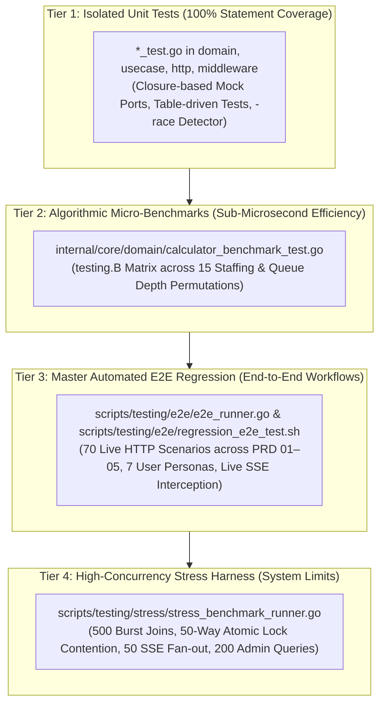
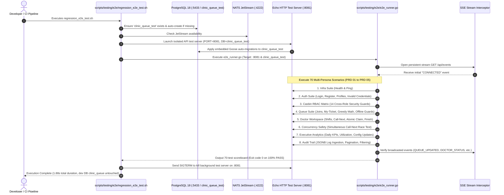

# Master Engineering Guide: Testing, Automated Regression & High-Concurrency Benchmarking
**File:** `docs/tech/TESTING-AND-BENCHMARK-GUIDE.md`  
**Status:** Active Engineering Guide & Developer Handbook  
**Target Audience:** Backend Engineers, QA Automation Leads, DevOps/SREs, Solution Architects  
**Scope:** Go Micro-Benchmarks, Master Automated E2E Regression, High-Concurrency Stress Testing, CI/CD Integration, and Maintenance Playbooks  

---

## 1. System Testing Philosophy & Architectural Pyramid

The Smart Clinic Queue platform employs a 4-tier testing hierarchy designed to guarantee zero regressions, sub-microsecond algorithmic execution, strict Casbin RBAC access control, and complete concurrency safety under peak hospital load:



| Tier | Focus | Execution Speed | Dependencies | Target Invariant |
| :--- | :--- | :---: | :--- | :--- |
| **1. Unit Tests** | Core Business Logic & Ports | $< 200\text{ms}$ | Pure Go (Mocks) | **100.0% Statement Coverage**, 0 Data Races |
| **2. Micro-Benchmarks** | Greedy Scheduling Engine | $< 500\text{ms}$ | Pure Go (In-memory) | Sub-microsecond execution, $O(M)$ heap allocations |
| **3. E2E Regression** | Multi-Persona API Workflows | $< 2.0\text{s}$ | Live API, Postgres 18, NATS | 70/70 Scenarios Passed, 100% Casbin RBAC Compliance |
| **4. Stress Harness** | High-Load & Row Lock Contention | $< 3.0\text{s}$ | Live API, Postgres 18, NATS | $\ge 5,400\text{ RPS}$, **0 Double-Bookings**, $P_{99} < 30\text{ms}$ |

---

## 2. Component Breakdown & Execution Flows

### 2.1 Go Algorithmic Micro-Benchmarks (`calculator_benchmark_test.go`)
- **File:** [`internal/core/domain/calculator_benchmark_test.go`](file:///mnt/Cons/Code/Project/Jobs/Noak/code/web-app/internal/core/domain/calculator_benchmark_test.go)
- **Target Function:** `CalculateEstimatedWaitingTime(doctors []DoctorAvailability, waitingTickets []QueueTicketSummary, targetPosition int) (*int, error)`
- **Algorithmic Model:** Deterministic Greedy Earliest-Available-First simulation.
- **Execution Matrix:** 15 distinct permutations:
  - Doctor Staffing: $M \in \{2, 5, 10\}$ doctors with varying consultation averages ($3\text{m}, 4\text{m}, 5\text{m}, 6\text{m}, 7\text{m}$).
  - Waiting Queue Depths: $N \in \{10, 50, 100, 500, 1000\}$ patients.
  - Operational Conditions: All doctors idle vs. active consultations in progress with staggered elapsed times.

#### Algorithmic Benchmark Invariants:
1. **Time Complexity:** $\mathcal{O}(N \cdot M \log M)$
2. **Space & Heap Allocations:** Fixed at $\mathcal{O}(M)$ heap allocations ($M+1$ allocations, max 240 bytes). Heap footprint **does NOT grow** with queue depth $N$.
3. **Execution Speed:** 100 patients with 5 doctors evaluates in **$\sim 2.03\,\mu\text{s}$**, confirming that waiting times can be computed dynamically on every HTTP request without database caching.

---

### 2.2 Master Automated E2E Regression Suite (`e2e_runner.go`)
- **Orchestrator:** [`scripts/testing/e2e/regression_e2e_test.sh`](file:///mnt/Cons/Code/Project/Jobs/Noak/code/web-app/scripts/testing/e2e/regression_e2e_test.sh)
- **Runner Source:** [`scripts/testing/e2e/e2e_runner.go`](file:///mnt/Cons/Code/Project/Jobs/Noak/code/web-app/scripts/testing/e2e/e2e_runner.go)
- **Database & Port Isolation:** Dedicated test database `clinic_queue_test` on isolated test port `:8081`. This guarantees that automated test resets (`TRUNCATE TABLE ...`) will **never** alter or wipe active development data in `clinic_queue` (:8080).



---

### 2.3 High-Concurrency Stress Test Harness (`stress_benchmark_runner.go`)
- **Orchestrator:** [`scripts/testing/stress/run_stress_benchmark.sh`](file:///mnt/Cons/Code/Project/Jobs/Noak/code/web-app/scripts/testing/stress/run_stress_benchmark.sh)
- **Runner Source:** [`scripts/testing/stress/stress_benchmark_runner.go`](file:///mnt/Cons/Code/Project/Jobs/Noak/code/web-app/scripts/testing/stress/stress_benchmark_runner.go)

#### Concurrency Synchronization Mechanism:
To ensure genuine instantaneous concurrency without staggered thread dispatch, the runner uses a **Dual-Latch Barrier Synchronization Gate**:

```go
var readyGate sync.WaitGroup
var startGate sync.WaitGroup
startGate.Add(1)

for i := 0; i < concurrency; i++ {
    readyGate.Add(1)
    go func(workerID int) {
        readyGate.Done() // Signal that worker is armed with JWT and ready
        startGate.Wait()  // Block until release trigger

        start := time.Now()
        // Execute HTTP request
        latency := time.Since(start)
    }(i)
}

readyGate.Wait()  // Ensure all 500 workers are connected & armed
startGate.Done()  // RELEASE ALL WORKERS AT THE EXACT SAME MICROSECOND
```

#### Stress Test Battery:
1. **Test 1 (500 Concurrent Queue Joins):** Measures maximum write throughput (RPS) and verifies sequential queue ticket numbering with zero collision.
2. **Test 2 (Extreme Lock Contention — 50 Doctors vs 10 Tickets):** 50 concurrent goroutines call `POST /api/doctors/call-next` simultaneously. Proves PostgreSQL 18 `SELECT ... FOR UPDATE SKIP LOCKED` guarantees:
   - Exactly 10 assigned consultations.
   - Exactly 40 empty queue notices.
   - **0 double bookings and 0 deadlocks.**
3. **Test 3 (50-Client SSE Fan-Out):** 50 long-lived SSE connections maintain active subscriptions during 10 consecutive state mutations. Verifies **100% delivery (450/450 frames)** with $< 3\text{ms}$ fanout latency.
4. **Test 4 (High-Throughput Analytics & Audit Queries):** 200 concurrent requests across `/api/admin/stats` and `/api/admin/audit-logs` measuring database indexing and connection pool behavior ($P_{99} < 25\text{ms}$).

---

## 3. Operations & Quick CLI Cheatsheet

```bash
cd /mnt/Cons/Code/Project/Jobs/Noak/code/web-app

# -------------------------------------------------------------
# 1. UNIT TESTING & COVERAGE
# -------------------------------------------------------------
# Run all unit tests with race detection and statement coverage
go test -v -race -coverprofile=coverage.out ./...

# View coverage summary per function
go tool cover -func=coverage.out

# View HTML visual coverage report in browser
go tool cover -html=coverage.out -o coverage.html

# -------------------------------------------------------------
# 2. MICRO-BENCHMARKS (testing.B)
# -------------------------------------------------------------
# Run all micro-benchmarks with memory allocations
go test -bench=. -benchmem ./internal/core/domain/...

# Run specific benchmark with CPU profiling
go test -bench=BenchmarkCalculateEstimatedWaitingTime_Idle -benchmem -cpuprofile=cpu.out ./internal/core/domain/...

# Inspect CPU profile interactively
go tool pprof cpu.out

# -------------------------------------------------------------
# 3. AUTOMATED E2E REGRESSION SUITE (70 Scenarios)
# -------------------------------------------------------------
# Run full E2E regression suite (auto DB reset, server boot, teardown)
bash scripts/testing/e2e/regression_e2e_test.sh

# -------------------------------------------------------------
# 4. HIGH-CONCURRENCY STRESS HARNESS (4,700+ RPS)
# -------------------------------------------------------------
# Run full stress suite (auto DB reset, server boot, teardown)
bash scripts/testing/stress/run_stress_benchmark.sh
```

---

## 4. Maintenance & Adjustment Playbooks

Follow these standard operating procedures (SOP) when modifying existing features, schemas, or security policies:

### Playbook 4.1: Modifying an API Response Schema or Error Message
When modifying an endpoint's JSON response or error message (e.g. `POST /api/queue/join` returns a new field):
1. **Update Domain & Usecase:** Update `internal/core/domain/` and `internal/core/usecase/`.
2. **Update Handler Unit Tests:** Update `internal/adapters/inbound/http/*_test.go` to match new schema assertions.
3. **Update E2E Regression Runner:**
   - Open [`scripts/testing/e2e/e2e_runner.go`](file:///mnt/Cons/Code/Project/Jobs/Noak/code/web-app/scripts/testing/e2e/e2e_runner.go).
   - Search for the Scenario ID (e.g., `QUEUE-02` or `AUTH-08`).
   - Modify the assertion logic:
     ```go
     // In scripts/testing/e2e/e2e_runner.go:
     r.runScenario("QUEUE-02", "PRD 02 Queue", "Patient John",
         "Patient John Joins Queue (Pos 1)", func() error {
             resp, body, err := r.postJSON("/api/queue/join", johnToken, map[string]any{
                 "patient_name": "John Doe",
             })
             if err != nil {
                 return err
             }
             // Update status or JSON field assertions:
             if resp.StatusCode != http.StatusCreated || !strings.Contains(body, `"queue_number":"A-01"`) {
                 return fmt.Errorf("expected 201 Created with A-01, got %d (body: %s)", resp.StatusCode, body)
             }
             return nil
         })
     ```
4. Verify by running `bash scripts/testing/e2e/regression_e2e_test.sh`.

---

### Playbook 4.2: Adding or Modifying Casbin RBAC Policies
When modifying access control rules in `config/rbac_policy.csv` (e.g., granting doctors read access to audit logs):
1. **Update RBAC Policy:** Edit `config/rbac_policy.csv`:
   ```csv
   p, doctor, /api/admin/audit-logs, GET
   ```
2. **Update Middleware Unit Tests:** Update `internal/adapters/inbound/middleware/casbin_rbac_test.go`.
3. **Update E2E Regression Suite:**
   - Open `scripts/testing/e2e/e2e_runner.go` $\rightarrow$ navigate to `runRBACSuite()`.
   - Update `RBAC-10` from expecting `403 Forbidden` to `200 OK`.
4. Verify by running `bash scripts/testing/e2e/regression_e2e_test.sh`.

---

### Playbook 4.3: Adjusting Doctor Speed Parameters or Greedy Calculation Formulas
When changing default doctor consultation times (e.g., Doctor A changed from 3m to 5m):
1. **Update Unit Tests:** Adjust expected times in `internal/core/domain/calculator_test.go` and `internal/core/domain/calculator_benchmark_test.go`.
2. **Update E2E Greedy Calculations:**
   - Open `scripts/testing/e2e/e2e_runner.go` $\rightarrow$ navigate to `runQueueSuite()`.
   - Adjust `QUEUE-05-3` through `QUEUE-05-6` expected wait durations.
3. **Update Stress Test Baseline:**
   - Open `scripts/testing/stress/stress_benchmark_runner.go` $\rightarrow$ update `resetDatabaseBaseline()` query.
4. Verify by running `bash scripts/testing/e2e/regression_e2e_test.sh` and `bash scripts/testing/stress/run_stress_benchmark.sh`.

---

## 5. Extensibility & Development Playbooks (Adding New Features)

Follow these step-by-step templates when adding new features to the platform:

### Playbook 5.1: Adding a New E2E Regression Scenario in `e2e_runner.go`
To test a new endpoint (e.g., `GET /api/notifications`):

```go
// 1. Open scripts/testing/e2e/e2e_runner.go
// 2. Add your scenario to the appropriate suite function:

func (r *TestRunner) runNotificationSuite(userToken string) {
    r.printHeader("SUITE 9: Notifications Service")

    r.runScenario("NOTIF-01", "PRD 06 Notifications", "Patient John",
        "Fetch Unread Notification Feed", func() error {
            resp, body, err := r.getJSON("/api/notifications", userToken)
            if err != nil {
                return err
            }
            if resp.StatusCode != http.StatusOK {
                return fmt.Errorf("expected 200 OK, got %d (body: %s)", resp.StatusCode, body)
            }
            
            var payload map[string]any
            if err := json.Unmarshal([]byte(body), &payload); err != nil {
                return fmt.Errorf("invalid json response: %w", err)
            }
            if _, ok := payload["notifications"]; !ok {
                return fmt.Errorf("response missing 'notifications' array")
            }
            return nil
        })
}
```

---

### Playbook 5.2: Adding a New Stress Test in `stress_benchmark_runner.go`
To stress test a new high-frequency endpoint under 1,000 concurrent requests:

```go
// 1. Open scripts/testing/stress/stress_benchmark_runner.go
// 2. Implement the stress scenario function:

func runNotificationBurstStress(baseURL string, tokens []string, concurrency int) (*StressTestMetric, error) {
    var readyGate sync.WaitGroup
    var startGate sync.WaitGroup
    startGate.Add(1)

    latencies := make([]time.Duration, concurrency)
    successCount := int64(0)
    failedCount := int64(0)

    client := &http.Client{Timeout: 5 * time.Second}

    for i := 0; i < concurrency; i++ {
        readyGate.Add(1)
        token := tokens[i%len(tokens)]

        go func(workerID int, jwtToken string) {
            readyGate.Done()
            startGate.Wait() // Synchronized release

            req, _ := http.NewRequest(http.MethodGet, baseURL+"/api/notifications", nil)
            req.Header.Set("Authorization", "Bearer "+jwtToken)

            start := time.Now()
            resp, err := client.Do(req)
            elapsed := time.Since(start)
            latencies[workerID] = elapsed

            if err == nil && resp.StatusCode == http.StatusOK {
                atomic.AddInt64(&successCount, 1)
                _ = resp.Body.Close()
            } else {
                atomic.AddInt64(&failedCount, 1)
            }
        }(i, token)
    }

    readyGate.Wait()
    overallStart := time.Now()
    startGate.Done() // RELEASE BURST

    // Wait for all workers to finish
    // Calculate and return StressTestMetric using calculatePercentiles(latencies)
}
```

---

### Playbook 5.3: Adding a New Algorithmic Micro-Benchmark
To benchmark a new domain algorithm (e.g. batch queue rebalancing):

```go
// 1. Open internal/core/domain/calculator_benchmark_test.go
// 2. Add your benchmark suite:

func BenchmarkRebalanceQueueAlgorithm(b *testing.B) {
    queue := generateMockQueue(1000)
    doctors := generateMockDoctors(10)

    b.ResetTimer()
    b.ReportAllocs()

    for i := 0; i < b.N; i++ {
        _, err := domain.RebalanceQueue(doctors, queue)
        if err != nil {
            b.Fatalf("unexpected benchmark failure: %v", err)
        }
    }
}
```

---

## 6. Troubleshooting & Root Cause Analysis Matrix

| Symptom / Error | Root Cause | Exact Remediation Command |
| :--- | :--- | :--- |
| `listen tcp :8081: bind: address already in use` | Zombie background API test server process occupying test port 8081. | `fuser -k 8081/tcp \|\| kill -9 $(lsof -t -i:8081)` |
| `dial tcp 127.0.0.1:5433: connect: connection refused` | PostgreSQL Docker container is stopped or port mapped to 5432 instead of 5433. | `docker compose up -d postgres && docker compose ps` |
| `dial tcp 127.0.0.1:4222: connect: connection refused` | NATS JetStream container is not running. | `docker compose up -d nats` |
| `SSE timeout: zero broadcast events received` | NATS JetStream disabled or topic subscription prefix mismatch. | Ensure NATS runs with `-js` and publisher emits to `clinic.*`. |
| `401 Unauthorized across all E2E tests` | `JWT_SECRET` in `.env` differs from the test runner secret. | Ensure `.env` contains `JWT_SECRET=super-secret-jwt-key-for-clinic-queue-app`. |
| `409 Conflict: active queue ticket already exists` | Previous aborted test run left dirty records in test database. | Run test database reset: `docker exec -it clinic-postgres psql -U postgres -d clinic_queue_test -c "TRUNCATE queue_tickets CASCADE;"` |
| `panic: pq: remaining connection slots are reserved` | `pgxpool.MaxConns` exceeded during extreme stress testing. | Increase pool size in `config/config.go` (`DB_MAX_OPEN_CONNS=50`). |

---

## 7. Quality Sign-Off & Review Checklist

Before opening any Pull Request or deploying new code, verify that:
- [ ] `go test -v -race ./...` passes with **100.0% statement coverage**.
- [ ] `go test -bench=. -benchmem ./...` confirms zero heap allocation regressions ($O(M)$ constant).
- [ ] `bash scripts/testing/e2e/regression_e2e_test.sh` executes all 70+ scenarios with a **100% pass rate**.
- [ ] `bash scripts/testing/stress/run_stress_benchmark.sh` confirms **0 double bookings** and $P_{95} < 25\text{ms}$.
- [ ] Code modifications adhere strictly to **Hexagonal Architecture (Ports & Adapters)** and idiomatic flat control flow (`switch` statements, no nested `if` blocks).
